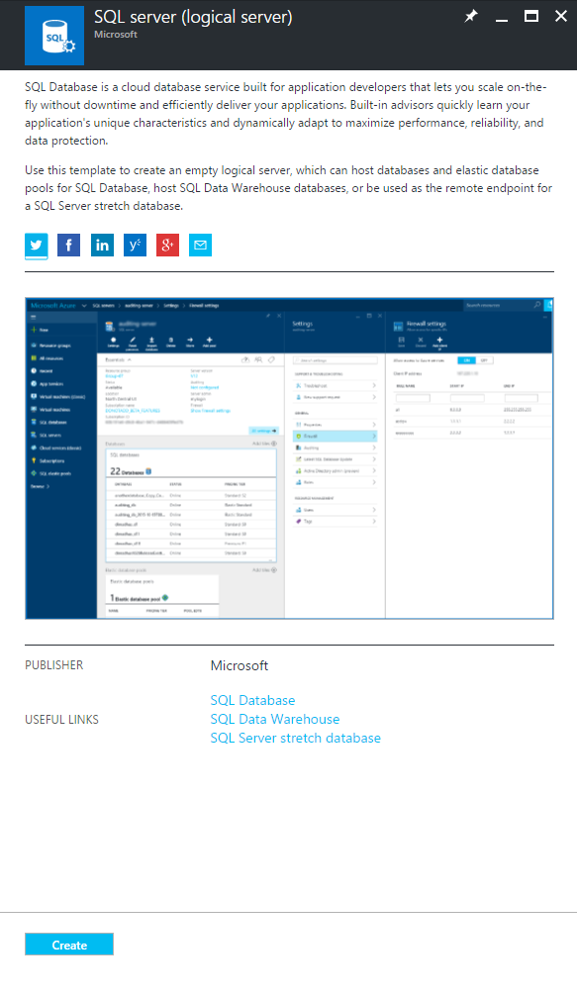
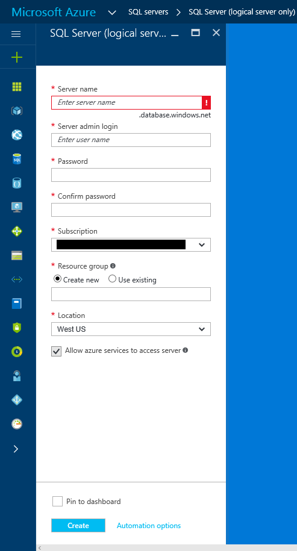
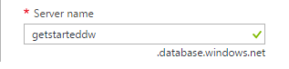
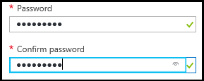
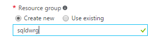
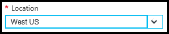

### Create a new logical SQL server in the Azure portal

1. Click **New**, search **logical server**, and then hit **ENTER**.

    
2. Select **SQL server (logical server)** 

    
  
3. Click **Create** to open the new SQL Server (logical server) blade.

   <kbd>  </kbd>
    <kbd> </kbd>
  
3. In the SQL Server (logical server) blade's server name text box, provide a valid name for the new logical server. A green check mark indicates that you have provided a valid name.
    
    

    > [!IMPORTANT]
    > The fully qualified name for your new server will be <your_server_name>.database.windows.net.
    >
    
4. In the Server admin login text box, provide a user name for the SQL authentication login for this server. This login is known as the server principal login. A green check mark indicates that you have provided a valid name.
    
    
5. In the **Password** and **Confirm password** text boxes, provide a password for the server principal login account. A green check mark indicates that you have provided a valid password.
    
    
6. Select a subscription in which you have permission to create objects.

    
7. In the Resource group text box, select **Create new** and then, in the resource group text box, provide a valid name for the new resource group (you can also use an existing resource group if you have already created one for yourself). A green check mark indicates that you have provided a valid name.

    

8. In the **Location** text box, select a data center appropriate to your location - such as "Australia East".
    
    
    
    > [!TIP]
    > The checkbox for **Allow azure services to access server** cannot be changed on this blade. You can change this setting on the server firewall blade. For more information, see [Get started with security](../articles/sql-database/sql-database-manage-servers-portal.md).
    >
    
9. Click **Create**.

    

