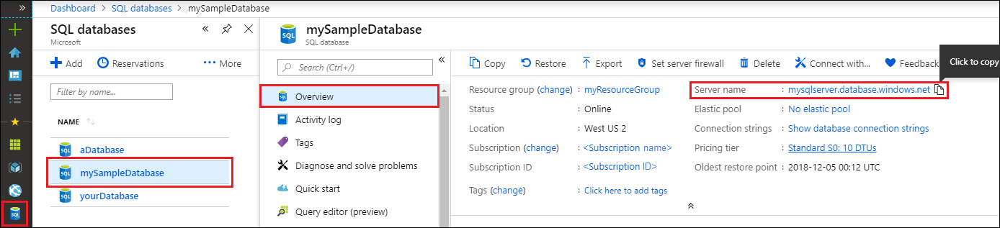

<!-- sql-database-connect-query-prerequisites-server-connection-info-includes.md 

## SQL server connection information
-->

Get the connection information needed to connect to the Azure SQL database. You will need the fully qualified server name, database name, and login information in the next procedures.

1. Sign in to the [Azure portal](https://portal.azure.com/).
2. Select **SQL Databases** from the left-hand menu, and click your database on the **SQL databases** page. 
3. On the **Overview** page for your database, review the fully qualified server name as shown in the following image. You can hover over the server name to bring up the **Click to copy** option.  

    

4. If you forget your server login information, navigate to the SQL Database server page to view the server admin name. If necessary, reset the password.

