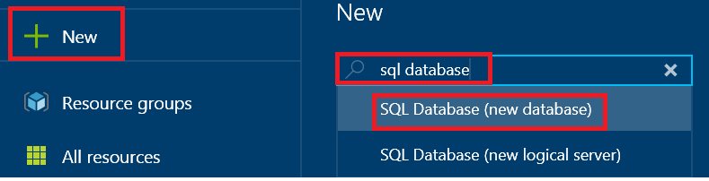
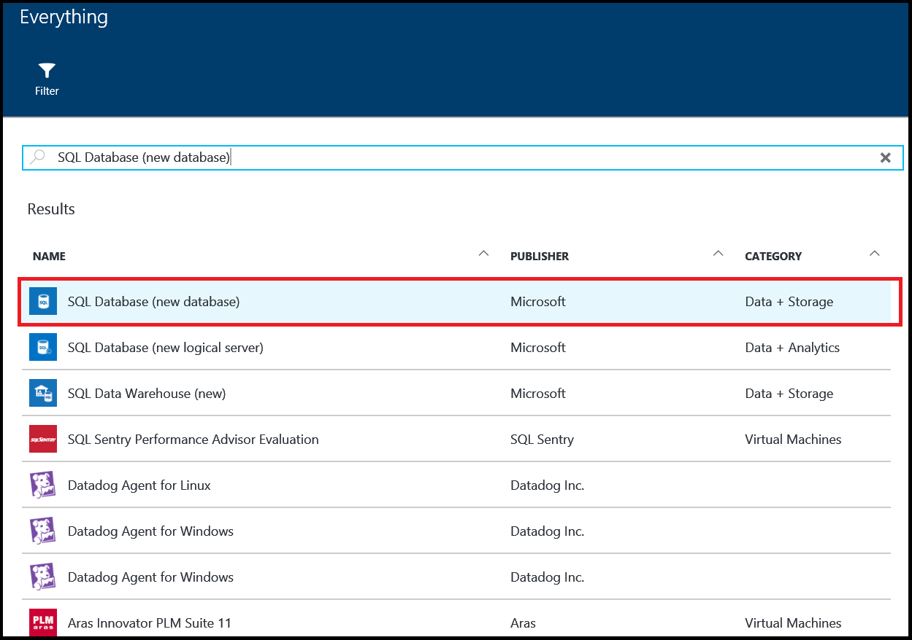
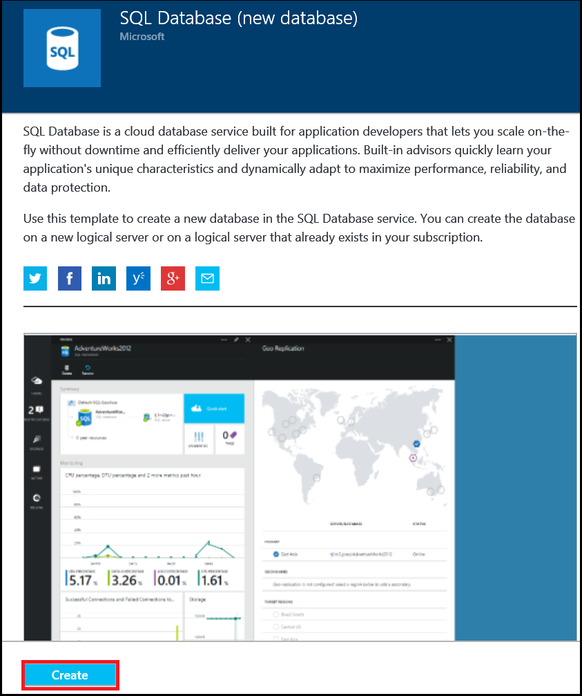
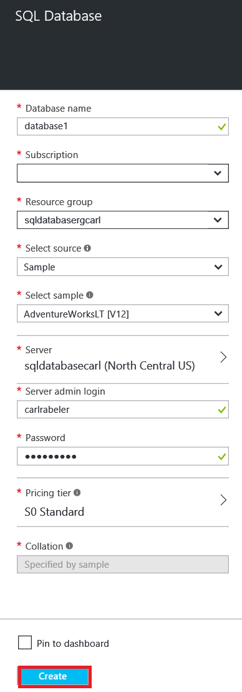
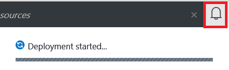
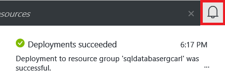

<!--
includes/sql-database-create-new-database-portal.md

Latest Freshness check:  2016-04-11 , carlrab.

As of circa 2016-04-11, the following topics might include this include:
articles/sql-database/sql-database-get-started-tutorial.md

-->
## Create a new Azure SQL database

Use the following steps in the Azure portal to create a new Azure SQL database on a new or existing Azure SQL Database logical server.

1. If you're not currently connected, connect to the [Azure portal](http://portal.azure.com).
2. Click **New**, type **SQL Database**, and then click **SQL Database (new database)**.

     

3. Click **SQL Database (new database)**.

     

4. Click **Create** to create a new database in the SQL Database service.

     

5. Provide the values for the following server properties:

 - Database name
 - Subscription: This applies only if you have multiple subscriptions.
 - Resource group: If you're just getting started, use the resource group of the logical server.
 - Select source: You can choose a blank database, sample data, or an Azure database backup. To migrate an on-premises SQL Server database or load data by using the BCP command-line tool, see the links at the end of this article.
 - Server: A new or existing logical server.
 - Server admin login
 - Password
 - Pricing tier: If you're just getting started, use the default value S0.
 - Collation: This applies only if a blank database was chosen.

        

6.  Click **Create**. In the notification area, you can see that deployment has started.

     

7. Wait for deployment to finish before continuing to the next step.

     
