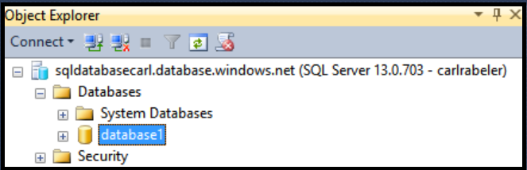
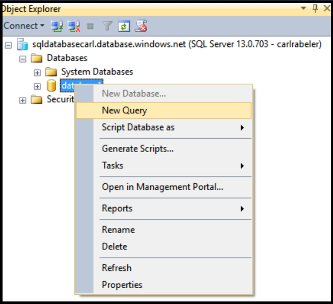
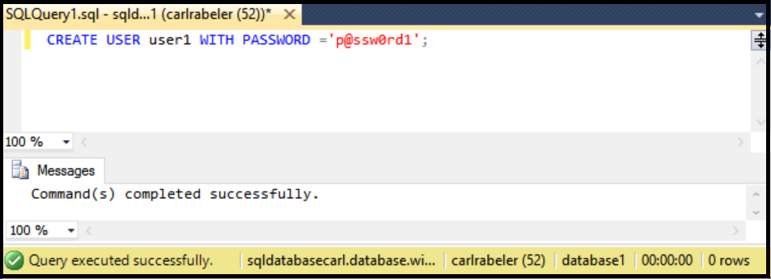

## Create new database user using SSMS

Use the following steps to create a new database user in an existing database using SSMS. 

These steps assume that you are connected to SQL Database in Object Explorer using SSMS and are connected to your SQL Database logical server as a server-level principal administrator or with a user account with permissions to create a new user. 

1. In Object Explorer, expand the Databases node and select the database in which you wish to create a new user account.

     

2. Right-click the selected database and then click **Query**.

     

3. In the query window, edit and use the following Transact-SQL statement to create a contained user in your user database. 

    ```CREATE USER user1 WITH PASSWORD ='p@ssw0rd1';
    ```

     


