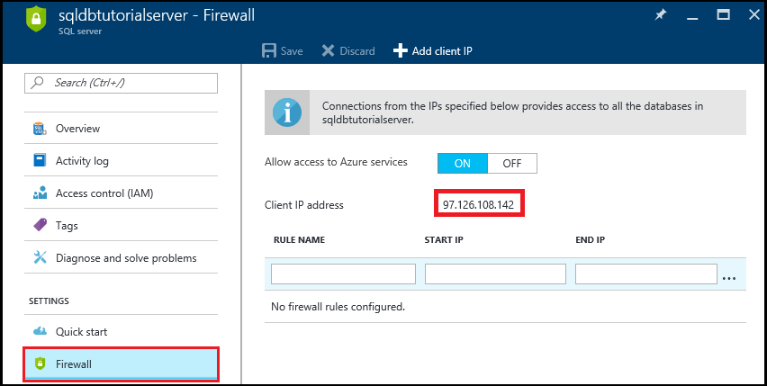
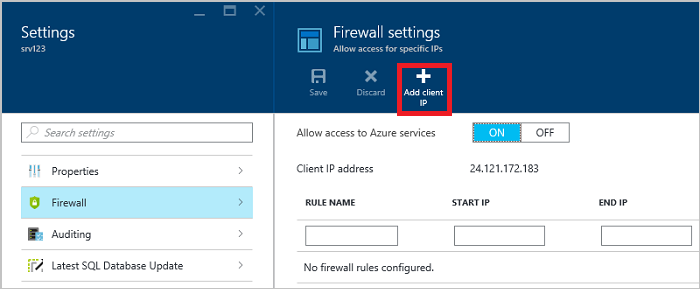

<!--
includes/sql-database-create-new-server-firewall-portal.md

Latest Freshness check:  2016-11-28 , rickbyh.

As of circa 2016-04-11, the following topics might include this include:
articles/sql-database/sql-database-get-started.md
articles/sql-database/sql-database-configure-firewall-settings
articles/sql-data-warehouse-get-started-provision.md

-->
### Create a server-level firewall rule in the Azure portal

1. On the SQL server blade, under Settings, click **Firewall** to open the Firewall blade for the SQL server.

    <!--  -->

2. Review the client IP address displayed and validate that this is your IP address on the Internet using a browser of your choice (ask "what is my IP address). Occasionally they do not match for a various reasons.

    <!--  -->

3. Assuming that the IP addresses match, click **Add client IP** on the toolbar.

    

    > [!NOTE]
    > You can open the SQL Database firewall on the server to a single IP address or an entire range of addresses. Opening the firewall enables SQL administrators and users to login to any database on the server to which they have valid credentials.
    >

4. Click **Save** on the toolbar to save this server-level firewall rule and then click **OK**.

    

> [!Tip]
> For a tutorial, see [SQL Database tutorial: Create a server, a server-level firewall rule, a sample database, a database-level firewall rule and connect with SQL Server](../articles/sql-database/sql-database-get-started.md).    
>
