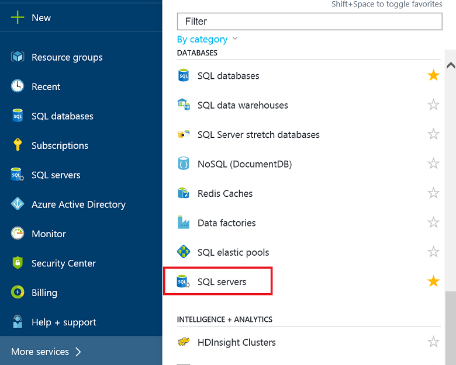
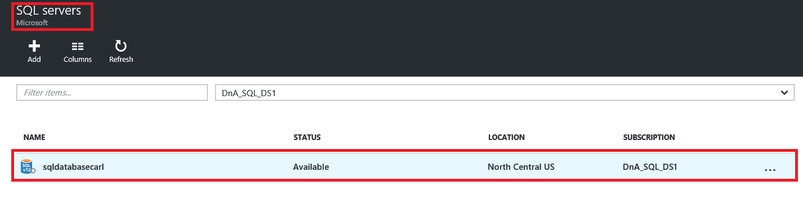
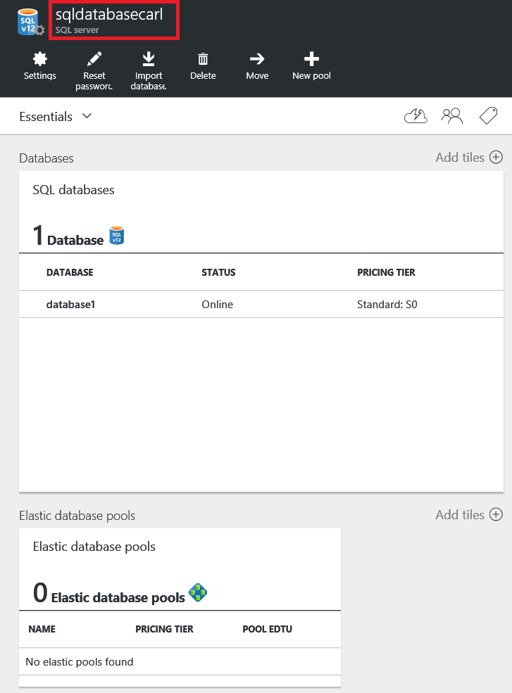
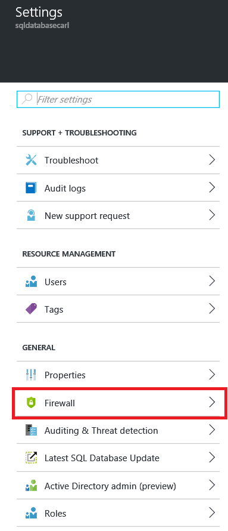
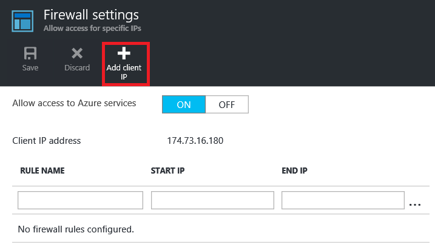
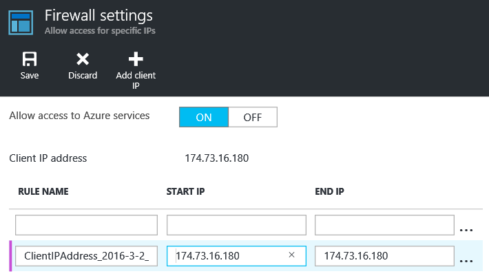
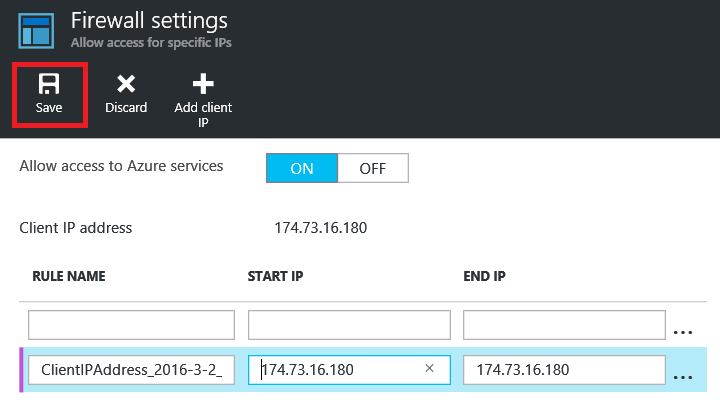

<!--
includes/sql-database-create-new-server-firewall-portal.md

Latest Freshness check:  2016-04-11 , carlrab.

As of circa 2016-04-11, the following topics might include this include:
articles/sql-database/sql-database-get-started-tutorial.md
articles/sql-database/sql-database-configure-firewall-settings

-->
## Create a new Azure SQL server-level firewall

Use the following steps in the Azure portal to create a server-level firewall rule that allows connections from an individual IP address (your client computer) or an entire IP address range to a SQL logical server. 

1. If not currently connected, connect to the [Azure portal](http://portal.azure.com).
2. In the default blade, click **SQL Server**.

  	

2. In the SQL Server blade, click the SQL server on which to create the firewall rule. 

 	
           
3. Review the properties of your server.

 	
      
4. In the Settings blade, click **Firewall**.

 	
    

 	> [AZURE.IMPORTANT] If you do not see the option for **Firewall** on the blade you are looking at, go back and make sure that you are looking at the blade for the SQL Database logical server and not the blade for a SQL database.

5. Click **Add Client IP** to have Azure create a rule for your client's IP address.

      

6. Optionally, click the IP address that was added to edit the firewall address to allow access to a range of IP addresses.

      
    
7. Click **Save** to create the server-level firewall rule.

     

	>[AZURE.IMPORTANT] Your Client IP address may change from time to time, and you may not be able to access your server until you create a new firewall rule. You can check your IP address using [Bing](http://www.bing.com/search?q=my%20ip%20address), and then add a single IP address or a range of IP addresses. See [Manage firewall settings](sql-database-configure-firewall-settings.md#manage-existing-server-level-firewall-rules-through-the-azure-portal) for details.
