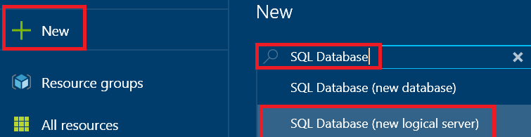
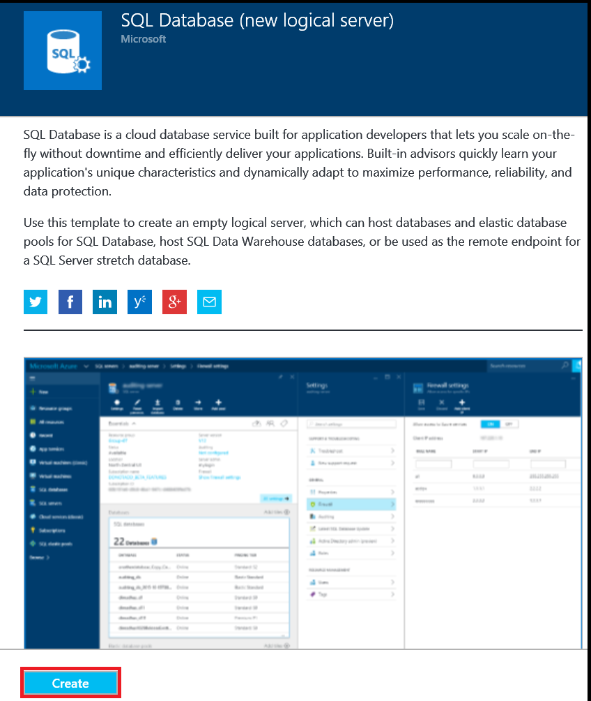
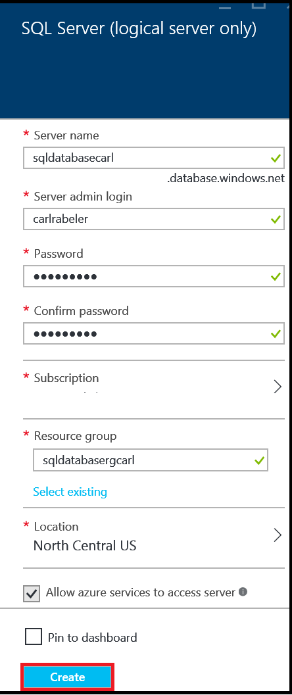
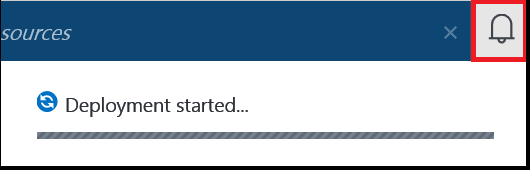
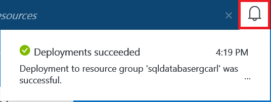

<!--
includes/sql-database-create-new-server-portal.md

Latest Freshness check:  2016-04-11 , carlrab.

As of circa 2016-04-11, the following topics might include this include:
articles/sql-database/sql-database-get-started-tutorial.md

-->
## Create an Azure SQL Database logical server

Use the following steps in the Azure portal to create an Azure SQL Database logical server.

1. If not currently connected, connect to the [Azure portal](http://portal.azure.com).
2. Click **New** , type **SQL Database** and then click **SQL Database (new logical server)**

      

3. Click SQL Database (new logical server).

      
   
4. Click **Create** to open a template to create an empty logical server that can host single databases and elastic database pools.

      

5. Provide the values for the following server properties:

 - Server name
 - Server admin login
 - Password
 - Subscription (only if have multiple subscriptions)
 - Resource group (new or existing)
 - Location

        

6.  Click **Create** and in the notification area, you can see that deployment has started.

       

7. Wait for deployment to finish before continuing to the next step.

       