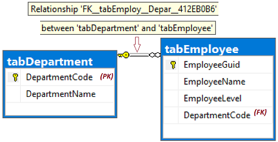

## C# program example

The next sections of this article present a C# program that uses ADO.NET to send Transact-SQL (T-SQL) statements to the SQL database. The C# program demonstrates the following actions:

- [Connect to SQL database using ADO.NET](#cs_1_connect)
- [Methods that return T-SQL statements](#cs_2_return)
    - Create tables
    - Populate tables with data
    - Update, delete, and select data
- [Submit T-SQL to the database](#cs_3_submit)

### Entity Relationship Diagram (ERD)

The `CREATE TABLE` statements involve the **REFERENCES** keyword to create a *foreign key* (FK) relationship between two tables. If you're using *tempdb*, comment out the `--REFERENCES` keyword using a pair of leading dashes.

The ERD displays the relationship between the two tables. The values in the **tabEmployee.DepartmentCode** *child* column are limited to values from the **tabDepartment.DepartmentCode** *parent* column.



> [!NOTE]
> You have the option of editing the T-SQL to add a leading `#` to the table names, which creates them as temporary tables in *tempdb*. This is useful for demonstration purposes, when no test database is available. Any reference to foreign keys are not enforced during their use and temporary tables are deleted automatically when the connection closes after the program finishes running.

### To compile and run

The C# program is logically one .cs file, and is physically divided into several code blocks, to make each block easier to understand. To compile and run the program, do the following steps:

1. Create a C# project in Visual Studio. The project type should be a *Console*, found under **Templates** > **Visual C#** > **Windows Desktop** > **Console App (.NET Framework)**.

1. In the file *Program.cs*, replace the starter lines of code with the following steps:

    1. Copy and paste the following code blocks, in the same sequence they're presented, see [Connect to database](#cs_1_connect), [Generate T-SQL](#cs_2_return), and [Submit to database](#cs_3_submit).

    1. Change the following values in the `Main` method:

        - *cb.DataSource*
        - *cb.UserID*
        - *cb.Password*
        - *cb.InitialCatalog*

1. Verify the assembly *System.Data.dll* is referenced. To verify, expand the **References** node in the **Solution Explorer** pane.

1. To build and run the program from Visual Studio, select the **Start** button. The report output is displayed in a program window, though GUID values will vary between test runs.

    ```Output
    =================================
    T-SQL to 2 - Create-Tables...
    -1 = rows affected.

    =================================
    T-SQL to 3 - Inserts...
    8 = rows affected.

    =================================
    T-SQL to 4 - Update-Join...
    2 = rows affected.

    =================================
    T-SQL to 5 - Delete-Join...
    2 = rows affected.

    =================================
    Now, SelectEmployees (6)...
    8ddeb8f5-9584-4afe-b7ef-d6bdca02bd35 , Alison , 20 , acct , Accounting
    9ce11981-e674-42f7-928b-6cc004079b03 , Barbara , 17 , hres , Human Resources
    315f5230-ec94-4edd-9b1c-dd45fbb61ee7 , Carol , 22 , acct , Accounting
    fcf4840a-8be3-43f7-a319-52304bf0f48d , Elle , 15 , NULL , NULL
    View the report output here, then press any key to end the program...
    ```

<a name="cs_1_connect"/>

### Connect to SQL database using ADO.NET

```csharp
using System;
using System.Data.SqlClient;   // System.Data.dll
//using System.Data;           // For:  SqlDbType , ParameterDirection

namespace csharp_db_test
{
    class Program
    {
        static void Main(string[] args)
        {
            try
            {
                var cb = new SqlConnectionStringBuilder();
                cb.DataSource = "your_server.database.windows.net";
                cb.UserID = "your_user";
                cb.Password = "your_password";
                cb.InitialCatalog = "your_database";

                using (var connection = new SqlConnection(cb.ConnectionString))
                {
                    connection.Open();

                    Submit_Tsql_NonQuery(connection, "2 - Create-Tables", Build_2_Tsql_CreateTables());

                    Submit_Tsql_NonQuery(connection, "3 - Inserts", Build_3_Tsql_Inserts());

                    Submit_Tsql_NonQuery(connection, "4 - Update-Join", Build_4_Tsql_UpdateJoin(),
                        "@csharpParmDepartmentName", "Accounting");

                    Submit_Tsql_NonQuery(connection, "5 - Delete-Join", Build_5_Tsql_DeleteJoin(),
                        "@csharpParmDepartmentName", "Legal");

                    Submit_6_Tsql_SelectEmployees(connection);
                }
            }
            catch (SqlException e)
            {
                Console.WriteLine(e.ToString());
            }

            Console.WriteLine("View the report output here, then press any key to end the program...");
            Console.ReadKey();
        }
```

<a name="cs_2_return"/>

### Methods that return T-SQL statements

```csharp
static string Build_2_Tsql_CreateTables()
{
    return @"
        DROP TABLE IF EXISTS tabEmployee;
        DROP TABLE IF EXISTS tabDepartment;  -- Drop parent table last.

        CREATE TABLE tabDepartment
        (
            DepartmentCode  nchar(4)          not null    PRIMARY KEY,
            DepartmentName  nvarchar(128)     not null
        );

        CREATE TABLE tabEmployee
        (
            EmployeeGuid    uniqueIdentifier  not null  default NewId()    PRIMARY KEY,
            EmployeeName    nvarchar(128)     not null,
            EmployeeLevel   int               not null,
            DepartmentCode  nchar(4)              null
            REFERENCES tabDepartment (DepartmentCode)  -- (REFERENCES would be disallowed on temporary tables.)
        );
    ";
}

static string Build_3_Tsql_Inserts()
{
    return @"
        -- The company has these departments.
        INSERT INTO tabDepartment (DepartmentCode, DepartmentName)
        VALUES
            ('acct', 'Accounting'),
            ('hres', 'Human Resources'),
            ('legl', 'Legal');

        -- The company has these employees, each in one department.
        INSERT INTO tabEmployee (EmployeeName, EmployeeLevel, DepartmentCode)
        VALUES
            ('Alison'  , 19, 'acct'),
            ('Barbara' , 17, 'hres'),
            ('Carol'   , 21, 'acct'),
            ('Deborah' , 24, 'legl'),
            ('Elle'    , 15, null);
    ";
}

static string Build_4_Tsql_UpdateJoin()
{
    return @"
        DECLARE @DName1  nvarchar(128) = @csharpParmDepartmentName;  --'Accounting';

        -- Promote everyone in one department (see @parm...).
        UPDATE empl
        SET
            empl.EmployeeLevel += 1
        FROM
            tabEmployee   as empl
        INNER JOIN
            tabDepartment as dept ON dept.DepartmentCode = empl.DepartmentCode
        WHERE
            dept.DepartmentName = @DName1;
    ";
}

static string Build_5_Tsql_DeleteJoin()
{
    return @"
        DECLARE @DName2  nvarchar(128);
        SET @DName2 = @csharpParmDepartmentName;  --'Legal';

        -- Right size the Legal department.
        DELETE empl
        FROM
            tabEmployee   as empl
        INNER JOIN
            tabDepartment as dept ON dept.DepartmentCode = empl.DepartmentCode
        WHERE
            dept.DepartmentName = @DName2

        -- Disband the Legal department.
        DELETE tabDepartment
            WHERE DepartmentName = @DName2;
    ";
}

static string Build_6_Tsql_SelectEmployees()
{
    return @"
        -- Look at all the final Employees.
        SELECT
            empl.EmployeeGuid,
            empl.EmployeeName,
            empl.EmployeeLevel,
            empl.DepartmentCode,
            dept.DepartmentName
        FROM
            tabEmployee   as empl
        LEFT OUTER JOIN
            tabDepartment as dept ON dept.DepartmentCode = empl.DepartmentCode
        ORDER BY
            EmployeeName;
    ";
}
```

<a name="cs_3_submit"/>

### Submit T-SQL to the database

```csharp
static void Submit_6_Tsql_SelectEmployees(SqlConnection connection)
{
    Console.WriteLine();
    Console.WriteLine("=================================");
    Console.WriteLine("Now, SelectEmployees (6)...");

    string tsql = Build_6_Tsql_SelectEmployees();

    using (var command = new SqlCommand(tsql, connection))
    {
        using (SqlDataReader reader = command.ExecuteReader())
        {
            while (reader.Read())
            {
                Console.WriteLine("{0} , {1} , {2} , {3} , {4}",
                    reader.GetGuid(0),
                    reader.GetString(1),
                    reader.GetInt32(2),
                    (reader.IsDBNull(3)) ? "NULL" : reader.GetString(3),
                    (reader.IsDBNull(4)) ? "NULL" : reader.GetString(4));
            }
        }
    }
}

static void Submit_Tsql_NonQuery(
    SqlConnection connection,
    string tsqlPurpose,
    string tsqlSourceCode,
    string parameterName = null,
    string parameterValue = null
    )
{
    Console.WriteLine();
    Console.WriteLine("=================================");
    Console.WriteLine("T-SQL to {0}...", tsqlPurpose);

    using (var command = new SqlCommand(tsqlSourceCode, connection))
    {
        if (parameterName != null)
        {
            command.Parameters.AddWithValue(  // Or, use SqlParameter class.
                parameterName,
                parameterValue);
        }
        int rowsAffected = command.ExecuteNonQuery();
        Console.WriteLine(rowsAffected + " = rows affected.");
    }
}
} // EndOfClass
}
```