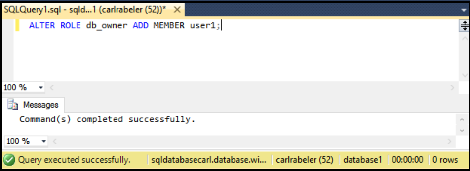

## Grant new database user db_owner permissions

Use the following steps to grant an existing database user db_owner permissions

Theses steps assume that you are connected to SQL Database in Object Explorer in SSMS and are connected to your SQL Database logical server as a server-level principal administrator or with a user account with permissions to grant user permissions. 

1. In Object Explorer, expand the Databases node and select the database with the user to which you wish to grant dbo permissions.

     

2. Right-click the selected database and then click **Query**.

     

3. In the query window, edit and use the following Transact-SQL statement to grant dbo permissions to a specified user. 

    ```ALTER ROLE db_owner ADD MEMBER user1;
    ```

     


