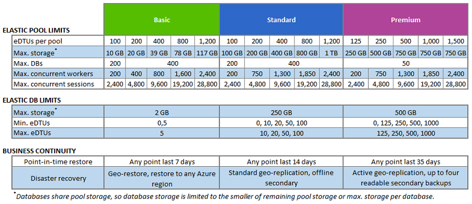

 

> [AZURE.IMPORTANT] * Elastic database share pool storage, so database storage is limited to the smaller of the remaining pool storage or max storage per database

|Elastic Pool| Basic | 
|:---:|:---:|
|eDTUs per pool|100 &nbsp;200 &nbsp;400 &nbsp;800 &nbsp;1200|
|Max storage per pool (GB)*|&nbsp;&nbsp;10 &nbsp;&nbsp;&nbsp;20 &nbsp;&nbsp;&nbsp;39 &nbsp;&nbsp;&nbsp;73 &nbsp;&nbsp;&nbsp;117|
|Max number of databases per pool|200 &nbsp;400 &nbsp;400 &nbsp;400 &nbsp;400|
|Max concurrent workers per pool|&nbsp;&nbsp;&nbsp;200 &nbsp;&nbsp; 400 &nbsp;&nbsp;&nbsp;&nbsp; 800 &nbsp;&nbsp;&nbsp; 1600 &nbsp;&nbsp;&nbsp;&nbsp;2400|
|Max concurrent logins per pool|&nbsp;&nbsp;&nbsp;200 &nbsp;&nbsp; 400 &nbsp;&nbsp;&nbsp;&nbsp; 800 &nbsp;&nbsp;&nbsp; 1600 &nbsp;&nbsp;&nbsp;&nbsp;2400|
|Max concurrent sessions per pool|4800 &nbsp;9600 &nbsp; 19200 &nbsp; 28800 &nbsp; 28800|
|||
|||

|Elastic Pool| Standard | 
|:---:|:---:|
|eDTUs per pool|100 &nbsp;&nbsp; 200 &nbsp;&nbsp; 400 &nbsp;&nbsp; 800&nbsp;&nbsp;1200|
|Max storage per pool (GB)*|100 &nbsp;&nbsp; 200 &nbsp;&nbsp; 400 &nbsp;&nbsp; 800&nbsp;&nbsp;1200|
|Max number of databases per pool|200 &nbsp;&nbsp; 400 &nbsp;&nbsp; 400 &nbsp;&nbsp; 400&nbsp;&nbsp;&nbsp;400|
|Max concurrent workers per pool|&nbsp;&nbsp;&nbsp;200 &nbsp;&nbsp; 750 &nbsp;&nbsp;&nbsp;&nbsp; 1300 &nbsp;&nbsp;&nbsp; 1850 &nbsp;&nbsp;&nbsp;&nbsp;2400|
|Max concurrent logins per pool|&nbsp;&nbsp;&nbsp;200 &nbsp;&nbsp; 750 &nbsp;&nbsp;&nbsp;&nbsp; 1300 &nbsp;&nbsp;&nbsp; 1850 &nbsp;&nbsp;&nbsp;&nbsp;2400|
|Max concurrent sessions per pool|4800 &nbsp; 9600 &nbsp; 19200 &nbsp; 28800&nbsp;&nbsp; 28800|
|||
|||

|Elastic Pool| Premium | 
|:---:|:---:|
|eDTUs per pool|125 &nbsp;&nbsp; 250 &nbsp;&nbsp; 500 &nbsp;&nbsp; 1000 &nbsp;&nbsp; 1500|
|Max storage per pool (GB)*|250 &nbsp;&nbsp; 500 &nbsp;&nbsp; 750 &nbsp;&nbsp;&nbsp; 750 &nbsp;&nbsp;&nbsp;&nbsp; 750|
|Max number of databases per pool| 50 |
|Max concurrent workers per pool|&nbsp;&nbsp;200 &nbsp;&nbsp;&nbsp; 750 &nbsp;&nbsp;&nbsp; 1300 &nbsp;&nbsp; 1850 &nbsp;&nbsp;&nbsp;&nbsp; 2400 |
|Max concurrent logins per pool|&nbsp;&nbsp;200 &nbsp;&nbsp;&nbsp; 750 &nbsp;&nbsp;&nbsp; 1300 &nbsp;&nbsp; 1850 &nbsp;&nbsp;&nbsp;&nbsp; 2400 |
|Max concurrent sessions per pool|4800 &nbsp; 9600 &nbsp;19200 &nbsp;28800 &nbsp;&nbsp; 28800|
|||
|||

|Elastic database| Basic | 
|:---:|:---:|
|Max eDTUs per database|5|
|Min eDTUs per database|0, 5|
|Max storage per database (GB)*|2|
|Point-in-time-restore|Any point last 7 days|
|Disaster recovery|Active Geo-Replication|
|||
|||

|Elastic database| Standard | 
|:---:|:---:|
|Max eDTUs per database|10, 20, 50, 100|
|Min eDTUs per database|0, 10, 20, 50, 100|
|Max storage per database (GB)* |250|
|Point-in-time-restore|Any point last 7 days|
|Disaster recovery|Active Geo-Replication|
|||
|||

|Elastic database| Premium| 
|:---:|:---:|
|Max eDTUs per database|125, 250, 500, 1000|
|Min eDTUs per database|0, 125, 250, 500, 1000|
|Max storage per database (GB)*|500|
|Point-in-time-restore|Any point last 7 days|
|Disaster recovery|Active Geo-Replication|
|||
|||