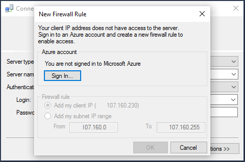

## Connect to Azure SQL Database using SQL Server Authentication
The following steps show how to connect to an Azure SQL server and database with SSMS. If you don't have a server and database, see [Create a SQL database in minutes](../articles/sql-database/sql-database-get-started.md) to create one.

1. Start SSMS by typing **Microsoft SQL Server Management Studio** in the Windows search box, and then click the desktop app.
2. In the **Connect to Server** window, enter the following information (if SSMS is already running, click **Connect > Database Engine** to open the **Connect to Server** window):
   
   * **Server type**: The default is database engine; do not change this value.
   * **Server name**: Enter the fully qualified name of your Azure SQL Database server in the following format: *&lt;servername>*.**database.windows.net**
   * **Authentication type**: This article shows you how to connect using **SQL Server Authentication**. For details on connecting with Azure Active Directory, see [Connect using Active Directory integrated authentication](../articles/sql-database/sql-database-aad-authentication.md#connect-using-active-directory-integrated-authentication), [Connect using Active Directory password authentication](../articles/sql-database/sql-database-aad-authentication.md#connect-using-active-directory-password-authentication), and [Connect using Active Directory Universal Authentication](../articles/sql-database/sql-database-ssms-mfa-authentication.md).
   * **User name**: Enter the name of a user with access to a database on the server (for example, the *server admin* you set up when creating the server). 
   * **Password**: Enter the password for the specified user (for example, the *password* you set up when creating the server).
     
       
3. Click **Connect**.
4. By default, new servers have no defined [firewall rules](../articles/sql-database/sql-database-firewall-configure.md) so clients are initially blocked from connecting. If your server does not yet have a firewall rule that allows your specific IP address to connect, SSMS prompts to create a server-level firewall rule for you.
   
    Click **Sign in** and create a server-level firewall rule. You must be an Azure administrator to create a server-level firewall rule.
   
       
5. After successfully connecting to your Azure SQL database, **Object Explorer** opens and you can now access your database to [perform administrative tasks or query data](../articles/sql-database/sql-database-manage-azure-ssms.md).
   
     

## Troubleshoot connection failures
The most common reasons for connection failures are mistakes in the server name, and network connectivity issues. Remember, <*servername*> is the name of the server, not the database, and you need to provide the fully qualified server name: `<servername>.database.windows.net`

Also, verify the user name and password do not contain any typos or extra spaces (user names are not case-sensitive, but passwords are). 

You can also explicitly set the protocol and port number with the server name like the following: `tcp:servername.database.windows.net,1433`

Network connectivity issues can also cause connection errors and timeouts. Simply retrying to connect (when you know that the server name, credentials, and firewall rules are correct) can lead to success.

For details and more about connectivity issues, see [Troubleshoot, diagnose, and prevent SQL connection errors and transient errors for SQL Database](../articles/sql-database/sql-database-connectivity-issues.md).

