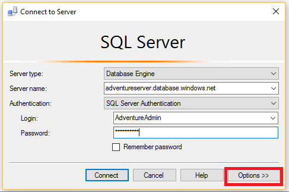
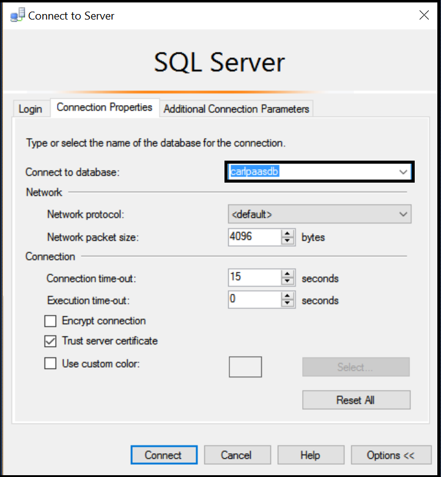
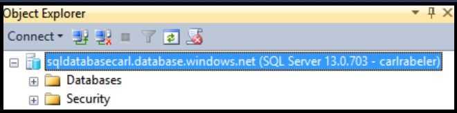

## Connect to Azure SQL Database as a user

Use the following steps to connect to Azure SQL Database with SSMS as a user.

1. Type "Microsoft SQL Server Management Studio" in the Windows search box, and then click the desktop app to start SSMS.

2. In the Connect to Server window, enter the following information:

- **Server type**: The default is database engine; do not change this value.
 - **Server name**: Enter the name of the server that hosts your SQL database in the followinbg format: *&lt;servername>*.**database.windows.net**
 - **Authentication type**: If you are just getting started, select SQL Authentication. If you have enabled Active Directory for your SQL Database logical server, you can select either Active Directory Password Authentication or Active Directory Integrated Authentication.
 - **User name**: If you selected either SQL Authentication or Active Directory Password Authentication, enter the name of a user with access to a database on the server.
 - **Password**: If you selected either SQL Authentication or Active Directory Password Authentication, enter the password for the specified user.
   
       

3. Click **Options** to specify the database to which you want to connect.

      
 
4. In the **Connect to Database**, select the database to which you wish to connect.

     

5. Click **Connect**.
 
6. If your client's IP address does not have access to the SQL Database logical server, you will be prompted to sign in to an Azure account and create a server-level firewall rule. If you are an Azure subscription administrator, Click **Sign in** to create a server-level firewall rule. If not, have an administrator create either a server-level firewall rule or a database-level firewall rule in the database to which you are trying to connect.
 
      
 
7. If your credentials grant you access to the specified database, Object Explorer opens and you can now perform administrative tasks or query data, depending upon the user permissions.
  
      
      
 
## Troubleshoot connection failures

The most common reason for connection failures are mistakes in the server name (remember, <*servername*> is the name of the logical server, not the database), the user name, or the password, as well as the server not allowing connections for security reasons. 

