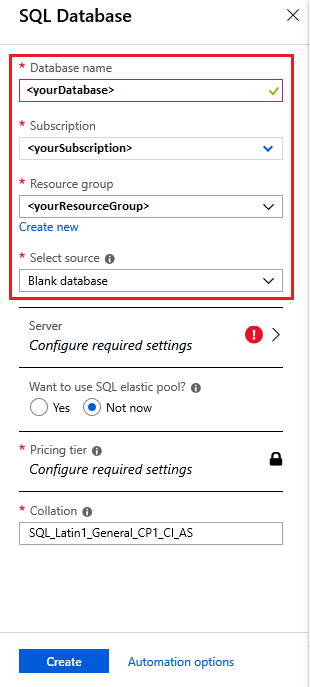

## Sign in to the Azure portal

Sign in to the [Azure portal](https://portal.azure.com/)

## Create a blank SQL database

An Azure SQL database exists within a defined set of [compute and storage resources](../articles/sql-database/sql-database-service-tiers-dtu.md). The database works under an [Azure resource group](../articles/azure-resource-manager/resource-group-overview.md) and an [Azure SQL database logical server](../articles/sql-database/sql-database-features.md).

Follow these steps to create a blank SQL database.

1. Click **Create a resource** in the upper left-hand corner of the Azure portal.

1. On the **New** page, select **Databases** > **SQL Database**.

   

1. In the **SQL Database** pane, type or select the following values:

   | Setting       | Suggested value | Description |
   | ------------ | ------------------ | ------------------------------------------------- |
   | **Database name** | *yourDatabase* | For valid database names, see [Database identifiers](/sql/relational-databases/databases/database-identifiers). |
   | **Subscription** | *yourSubscription*  | For details about your subscriptions, see [Subscriptions](https://account.windowsazure.com/Subscriptions). |
   | **Resource group** | *yourResourceGroup* | For valid resource group names, see [Naming rules and restrictions](/azure/architecture/best-practices/naming-conventions). |
   | **Select source** | Blank database | Specifies that a blank database should be created. |

   

   1. Select **Server** to configure a server for your new database. Then, type or select the following values:

      | Setting       | Suggested value | Description |
      | ------------ | ------------------ | ------------------------------------------------- |
      | **Server name** | Any globally unique name | For valid server names, see [Naming rules and restrictions](/azure/architecture/best-practices/naming-conventions). |
      | **Server admin login** | Any valid name | For valid login names, see [Database identifiers](/sql/relational-databases/databases/database-identifiers).|
      | **Password** | Any valid password | Your password must have at least 8 characters and must use characters from three of the following categories: upper case characters, lower case characters, numbers, and non-alphanumeric characters. |
      | **Location** | Any valid location | For information about regions, see [Azure regions](https://azure.microsoft.com/regions/). |

      Choose **Select**.

      

   1. Select **Pricing tier** to specify the service tier, the number of DTUs, and the amount of storage. Explore the options for the DTUs and storage that is available to you for each service tier.

      After selecting the server tier, the number of DTUs, and the amount of storage, select **Apply**.

   1. Enter a **Collation** for the blank database (for this tutorial, use the default value). For more information about collations, see [Collations](/sql/t-sql/statements/collations).

1. Now that you've completed the **SQL Database** form, select **Create** to create the database. This step can take up to a minute and a half to complete.

1. On the toolbar, click **Notifications** to monitor the deployment process.

     

## Create a firewall rule

The SQL database service creates a firewall at the server-level to prevent external applications and tools from connecting to the server or any databases on the server. Follow these steps to create a [SQL database server-level firewall rule](../articles/sql-database/sql-database-firewall-configure.md) for your client's IP address. This process enables external connectivity through the SQL database firewall for your IP address only.

> [!NOTE]
> SQL database communicates over port 1433. If you are trying to connect from within a corporate network, outbound traffic over port 1433 may not be allowed by your network's firewall. If so, you cannot connect to the Azure SQL database server unless your administrator opens port 1433.

1. After the deployment completes, choose **SQL databases** from the left-hand menu and then select *yourDatabase* on the **SQL databases** page. The **Overview** page for your database opens, showing you the fully qualified server name (such as *yourserver.database.windows.net*) and provides options for further configuration.

1. Copy the fully qualified server name for use to connect to your server and its databases in later steps.

   

1. Select **Set server firewall** on the toolbar. The **Firewall settings** page for the SQL database server opens.

   

   1. Select **Add client IP** on the toolbar to add your current IP address to a new firewall rule. A firewall rule can open port 1433 for a single IP address or a range of IP addresses.

   1. Choose **Save**. A server-level firewall rule is created for your current IP address opening port 1433 on the logical server.

   1. Select **OK** and then close the **Firewall settings** page.

Your IP address can now pass through the firewall and can now connect to the SQL database server and its databases using SSMS or another tool of your choice. Be sure to use the server's admin account you created previously.

> [!IMPORTANT]
> By default, access through the SQL database firewall is enabled for all Azure services. Select **OFF** on this page to disable for all Azure services.
