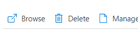
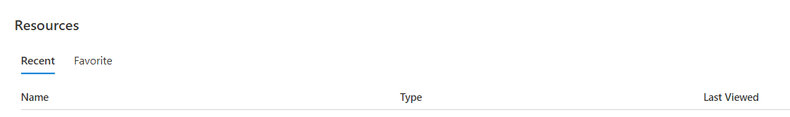
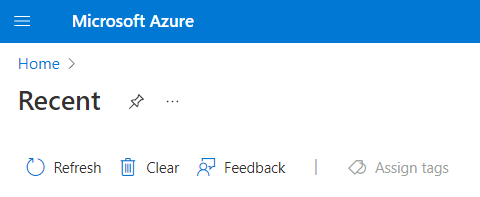

If you're not going to continue to use this application, you can delete the Azure Static Web App resource through the following steps:

1. Open the [Azure portal](https://portal.azure.com)
1. Choose whether to delete only the app or all related resources
   1. To delete only the app

      1. In the top search bar, search for your application by the name you provided earlier
      1. Select the app from the results
      1. Click on the **Delete** button
            

      1. Click **Yes** to confirm the delete action
      
   1. To delete all related resources.

      > [!IMPORTANT]
      > Check if any other apps use the resources before deleting them.
      
      1. Go to the Resources section

            

      1. Click Clear to remove all recent apps from the list

            

           

