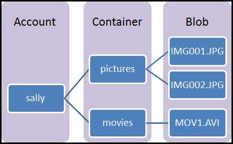

Azure Blob storage is Microsoft's object storage solution for the cloud. Blob storage is optimized for storing massive amounts of unstructured data, such as text or binary data.

Massively scalable object storage for unstructured data

Blob storage is ideal for:

* Serving images or documents directly to a browser.
* Storing files for distributed access.
* Streaming video and audio.
* Writing to log files.
* Storing data for backup and restore, disaster recovery, and archiving.
* Storing data for analysis by an on-premises or Azure-hosted service.

Objects in Blob storage can be accessed from anywhere in the world via HTTP or HTTPS. Users or client applications can access blobs via URLs, the [Azure Storage REST API](https://docs.microsoft.com/rest/api/storageservices/blob-service-rest-api), [Azure PowerShell](https://docs.microsoft.com/powershell/module/azure.storage), [Azure CLI](https://docs.microsoft.com/cli/azure/storage), or an Azure Storage client library. The storage client libraries are available for multiple languages, including [.NET](https://docs.microsoft.com/dotnet/api/overview/azure/storage/client), [Java](https://docs.microsoft.com/java/api/overview/azure/storage/client), [Node.js](http://azure.github.io/azure-storage-node), [Python](https://docs.microsoft.com/python/azure/), [PHP](http://azure.github.io/azure-storage-php/), and [Ruby](http://azure.github.io/azure-storage-ruby).

## Blob service concepts

Blob storage exposes three resources: your storage account, the containers in the account, and the blobs in a container. The following diagram shows the relationship between these resources.

### Storage Account

All access to data objects in Azure Storage happens through a storage account. For more information, see [Azure storage account overview](../articles/storage/common/storage-account-overview.md?toc=%2fazure%2fstorage%2fblobs%2ftoc.json).

### Container

A container organizes a set of blobs, similar to a folder in a file system. All blobs reside within a container. A storage account can contain an unlimited number of containers, and a container can store an unlimited number of blobs. Note that the container name must be lowercase.

### Blob
 
Azure Storage offers three types of blobs -- block blobs, append blobs, and [page blobs](../articles/storage/blobs/storage-blob-pageblob-overview.md) (used for VHD files).

* Block blobs store text and binary data, up to about 4.7 TB. Block blobs are made up of blocks of data that can be managed individually.
* Append blobs are made up of blocks like block blobs, but are optimized for append operations. Append blobs are ideal for scenarios such as logging data from virtual machines.
* Page blobs store random access files up to 8 TB in size. Page blobs store the VHD files that back VMs.

All blobs reside within a container. A container is similar to a folder in a file system. You can further organize blobs into virtual directories, and traverse them as you would a file system. 

For very large datasets where network constraints make uploading or downloading data to Blob storage over the wire unrealistic, you can ship a set of hard drives to Microsoft to import or export data directly from the data center. For more information, see [Use the Microsoft Azure Import/Export Service to Transfer Data to Blob Storage](../articles/storage/common/storage-import-export-service.md).
  
For details about naming containers and blobs, see [Naming and Referencing Containers, Blobs, and Metadata](/rest/api/storageservices/Naming-and-Referencing-Containers--Blobs--and-Metadata).
