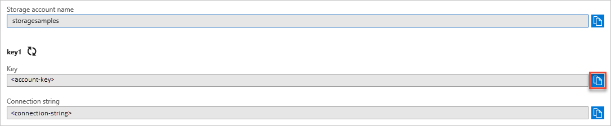

## Copy your credentials from the Azure portal

The sample application needs to authorize access to your storage account. Provide your storage account credentials to the application in the form of a connection string. To view your storage account credentials:

1. In to the [Azure portal](https://portal.azure.com) go to your storage account.
1. In the **Settings** section of the storage account overview, select **Access keys** to display your account access keys and connection string.
1. Note the name of your storage account, which you'll need for authorization.   
1. Find the **Key** value under **key1**, and select **Copy** to copy the account key.

    
