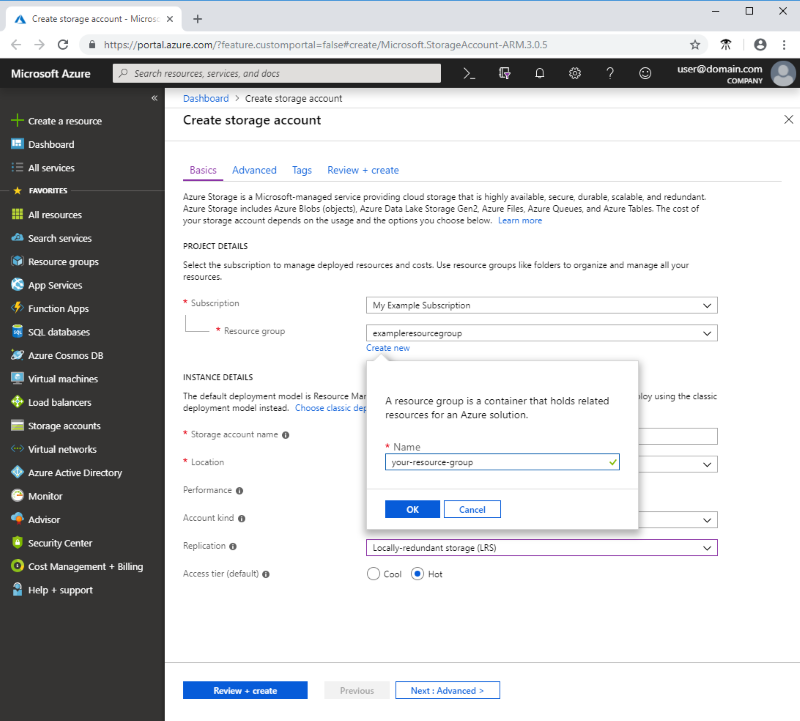

To create a general-purpose v2 storage account in the Azure portal, follow these steps:

1. In the Azure portal, select **All services**. In the list of resources, type **Storage Accounts**. As you begin typing, the list filters based on your input. Select **Storage Accounts**.
1. On the **Storage Accounts** window that appears, choose **Add**.
1. Select the subscription in which to create the storage account.
1. Under the **Resource group** field, select **Create new**. Enter a name for your new resource group, as shown in the following image.

    

1. Next, enter a name for your storage account. The name you choose must be unique across Azure. The name also must be between 3 and 24 characters in length, and can include numbers and lowercase letters only.
1. Select a location for your storage account, or use the default location.
1. Leave these fields set to their default values:

   |Field  |Value  |
   |---------|---------|
   |Deployment model     |Resource Manager         |
   |Performance     |Standard         |
   |Account kind     |StorageV2 (general-purpose v2)         |
   |Replication     |Read-access geo-redundant storage (RA-GRS)         |
   |Access tier     |Hot         |

1. Select **Review + Create** to review your storage account settings and create the account.
1. Select **Create**.

For more information about types of storage accounts and other storage account settings, see [Azure storage account overview](https://docs.microsoft.com/azure/storage/common/storage-account-overview). For more information on resource groups, see [Azure Resource Manager overview](https://docs.microsoft.com/azure/azure-resource-manager/resource-group-overview). 
