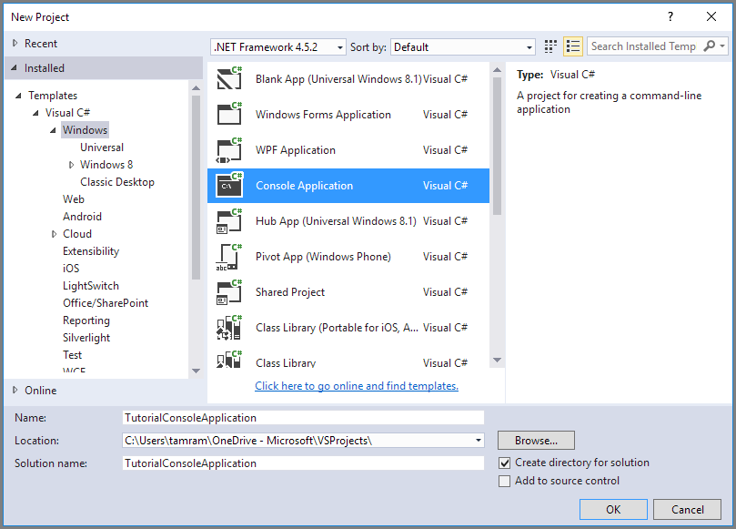

## Set up your development environment

Next, set up your development environment in Visual Studio so that you are ready to try the code examples provided in this guide.

### Create a Windows console application project

In Visual Studio, create a new Windows console application, as shown:

All of the code examples in this tutorial can be added to the **Main()** method in `program.cs` in your console application.

Note that you can use the Azure Storage Client Library from any type of .NET application, including an Azure cloud service, an Azure web app, a desktop application, or a mobile application. In this guide, we use a console application for simplicity.

### Use NuGet to install the required packages

There are two packages that you'll need to install to your project to complete this tutorial:

- [Microsoft Azure Storage Client Library for .NET](https://www.nuget.org/packages/WindowsAzure.Storage/): This package provides programmatic access to data resources in your storage account.
- [Microsoft Azure Configuration Manager library for .NET](https://www.nuget.org/packages/Microsoft.WindowsAzure.ConfigurationManager/): This package provides a class for parsing a connection string from a configuration file, regardless of where your application is running.

You can use NuGet to obtain both packages. Follow these steps:

1. Right-click your project in **Solution Explorer** and choose **Manage NuGet Packages**.
2. Search online for "WindowsAzure.Storage" and click **Install** to install the Storage Client Library and its dependencies.
3. Search online for "ConfigurationManager" and click **Install** to install the Azure Configuration Manager.

>[AZURE.NOTE] The Storage Client Library package is also included in the [Azure SDK for .NET](https://azure.microsoft.com/downloads/). However, we recommend that you also install the Storage Client Library from NuGet to ensure that you always have the latest version of the client library.
>
>The ODataLib dependencies in the Storage Client Library for .NET are resolved through the ODataLib (version 5.0.2 and greater) packages available through NuGet, and not through WCF Data Services. The ODataLib libraries can be downloaded directly or referenced by your code project through NuGet. The specific ODataLib packages used by the Storage Client Library are [OData](http://nuget.org/packages/Microsoft.Data.OData/5.0.2), [Edm](http://nuget.org/packages/Microsoft.Data.Edm/5.0.2), and [Spatial](http://nuget.org/packages/System.Spatial/5.0.2). While these libraries are used by the Azure Table storage classes, they are required dependencies for programming with the Storage Client Library.

### Determine your target environment

You have two environment options for running the examples in this guide:

- You can run your code against an Azure Storage account in the cloud. 
- You can run your code against the Azure storage emulator. The storage emulator is a local environment that emulates an Azure Storage account in the cloud. The emulator is a free option for testing and debugging your code while your application is under development. The emulator uses a well-known account and key. For more details, see [Use the Azure Storage Emulator for Development and Testing](../articles/storage/storage-use-emulator.md)

If you are targeting a storage account in the cloud, copy the primary access key for your storage account from the Azure Portal. For more information, see [View and copy storage access keys](../articles/storage/storage-create-storage-account.md#view-and-copy-storage-access-keys).

> [AZURE.NOTE] You can target the storage emulator to avoid incurring any costs associated with Azure Storage. However, if you do choose to target an Azure storage account in the cloud, costs for performing this tutorial will be negligible.

### Configure your storage connection string

The Azure Storage Client Library for .NET supports using a storage connection string to configure endpoints and credentials for accessing storage services. The best way to maintain your storage connection string is in a configuration file. 

For more information about connection strings, see [Configure a Connection String to Azure Storage](../articles/storage/storage-configure-connection-string.md).

> [AZURE.NOTE] Your storage account key is similar to the root password for your storage account. Always be careful to protect your storage account key. Avoid distributing it to other users, hard-coding it, or saving it in a plain-text file that is accessible to others. Regenerate your key using the Azure Portal if you believe it may have been compromised.

To configure your connection string, open the `app.config` file from Solution Explorer in Visual Studio. Add the contents of the `<appSettings>` element shown below. Replace `account-name` with the name of your storage account, and `account-key` with your account access key:

	<configuration>
	    <startup> 
	        <supportedRuntime version="v4.0" sku=".NETFramework,Version=v4.5.2" />
	    </startup>
  		<appSettings>
    		<add key="StorageConnectionString" value="DefaultEndpointsProtocol=https;AccountName=account-name;AccountKey=account-key" />
  		</appSettings>
	</configuration>

For example, your configuration setting will be similar to:

	<add key="StorageConnectionString" value="DefaultEndpointsProtocol=https;AccountName=storagesample;AccountKey=nYV0gln6fT7mvY+rxu2iWAEyzPKITGkhM88J8HUoyofvK7C6fHcZc2kRZp6cKgYRUM74lHI84L50Iau1+9hPjB==" />

To target the storage emulator, you can use a shortcut that maps to the well-known account name and key. In that case, your connection string setting will be:

	<add key="StorageConnectionString" value="UseDevelopmentStorage=true;" />

