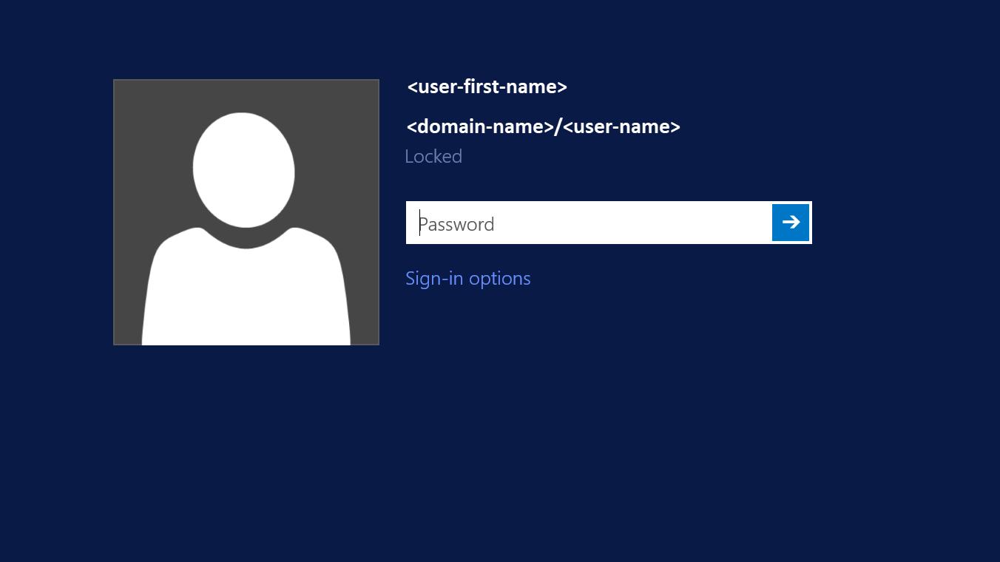

## Assign access permissions to an identity

To access Azure Files resources with identity based authentication, an identity (a user, group, or service principal) must have the necessary permissions at the share level. This process is similar to specifying Windows share permissions, where you specify the type of access that a particular user has to a file share. The guidance in this section demonstrates how to assign read, write, or delete permissions for a file share to an identity. 

We have introduced three Azure built-in roles for granting share-level permissions to users:

- **Storage File Data SMB Share Reader** allows read access in Azure Storage file shares over SMB.
- **Storage File Data SMB Share Contributor** allows read, write, and delete access in Azure Storage file shares over SMB.
- **Storage File Data SMB Share Elevated Contributor** allows read, write, delete and modify NTFS permissions in Azure Storage file shares over SMB.

> [!IMPORTANT]
> Full administrative control of a file share, including the ability to take ownership of a file, requires using the storage account key. Administrative control is not supported with Azure AD credentials.

You can use the Azure portal, PowerShell, or Azure CLI to assign the built-in roles to the Azure AD identity of a user for granting share-level permissions. Be aware that the share level Azure role assignment can take some time to be in effect. 

> [!NOTE]
> Remember to [sync your AD DS credentials to Azure AD](../articles/active-directory/hybrid/how-to-connect-install-roadmap.md) if you plan to use your on-premises AD DS for authentication. Password hash sync from AD DS to Azure AD is optional. Share level permission will be granted to the Azure AD identity that is synced from your on-premises AD DS.

The general recommendation is to use share level permission for high level access management to an AD group representing a group of users and identities, then leverage NTFS permissions for granular access control on directory/file level. 

### Assign an Azure role to an AD identity

# [Portal](#tab/azure-portal)
To assign an Azure role to an Azure AD identity, using the [Azure portal](https://portal.azure.com), follow these steps:

1. In the Azure portal, go to your file share, or [Create a file share](../articles/storage/files/storage-how-to-create-file-share.md).
2. Select **Access Control (IAM)**.
3. Select **Add a role assignment**
4. In the **Add role assignment** blade, select the appropriate built-in role (Storage File Data SMB Share Reader, Storage File Data SMB Share Contributor) from the **Role** list. Leave **Assign access to** at the default setting: **Azure AD user, group, or service principal**. Select the target Azure AD identity by name or email address.
5. Select **Save** to complete the role assignment operation.

# [PowerShell](#tab/azure-powershell)

The following PowerShell sample shows how to assign an Azure role to an Azure AD identity, based on sign-in name. For more information about assigning Azure roles with PowerShell, see [Manage access using RBAC and Azure PowerShell](../articles/role-based-access-control/role-assignments-powershell.md).

Before you run the following sample script, remember to replace placeholder values, including brackets, with your own values.

```powershell
#Get the name of the custom role
$FileShareContributorRole = Get-AzRoleDefinition "<role-name>" #Use one of the built-in roles: Storage File Data SMB Share Reader, Storage File Data SMB Share Contributor, Storage File Data SMB Share Elevated Contributor
#Constrain the scope to the target file share
$scope = "/subscriptions/<subscription-id>/resourceGroups/<resource-group>/providers/Microsoft.Storage/storageAccounts/<storage-account>/fileServices/default/fileshares/<share-name>"
#Assign the custom role to the target identity with the specified scope.
New-AzRoleAssignment -SignInName <user-principal-name> -RoleDefinitionName $FileShareContributorRole.Name -Scope $scope
```

# [Azure CLI](#tab/azure-cli)
  
The following CLI 2.0 command shows how to assign an Azure role to an Azure AD identity, based on sign-in name. For more information about assigning Azure roles with Azure CLI, see [Manage access by using RBAC and Azure CLI](../articles/role-based-access-control/role-assignments-cli.md). 

Before you run the following sample script, remember to replace placeholder values, including brackets, with your own values.

```azurecli-interactive
#Assign the built-in role to the target identity: Storage File Data SMB Share Reader, Storage File Data SMB Share Contributor, Storage File Data SMB Share Elevated Contributor
az role assignment create --role "<role-name>" --assignee <user-principal-name> --scope "/subscriptions/<subscription-id>/resourceGroups/<resource-group>/providers/Microsoft.Storage/storageAccounts/<storage-account>/fileServices/default/fileshares/<share-name>"
```
---

## Configure NTFS permissions over SMB

After you assign share-level permissions with RBAC, you must assign proper NTFS permissions at the root, directory, or file level. Think of share-level permissions as the high-level gatekeeper that determines whether a user can access the share. Whereas NTFS permissions act at a more granular level to determine what operations the user can do at the directory or file level.

Azure Files supports the full set of NTFS basic and advanced permissions. You can view and configure NTFS permissions on directories and files in an Azure file share by mounting the share and then using Windows File Explorer or running the Windows [icacls](/windows-server/administration/windows-commands/icacls) or [Set-ACL](/powershell/module/microsoft.powershell.security/set-acl) command. 

To configure NTFS with superuser permissions, you must mount the share by using your storage account key from your domain-joined VM. Follow the instructions in the next section to mount an Azure file share from the command prompt and to configure NTFS permissions accordingly.

The following sets of permissions are supported on the root directory of a file share:

- BUILTIN\Administrators:(OI)(CI)(F)
- NT AUTHORITY\SYSTEM:(OI)(CI)(F)
- BUILTIN\Users:(RX)
- BUILTIN\Users:(OI)(CI)(IO)(GR,GE)
- NT AUTHORITY\Authenticated Users:(OI)(CI)(M)
- NT AUTHORITY\SYSTEM:(F)
- CREATOR OWNER:(OI)(CI)(IO)(F)

### Mount a file share from the command prompt

Use the Windows **net use** command to mount the Azure file share. Remember to replace the placeholder values in the following example with your own values. For more information about mounting file shares, see [Use an Azure file share with Windows](../articles/storage/files/storage-how-to-use-files-windows.md). 

```
$connectTestResult = Test-NetConnection -ComputerName <storage-account-name>.file.core.windows.net -Port 445
if ($connectTestResult.TcpTestSucceeded)
{
 net use <desired-drive letter>: \\<storage-account-name>.file.core.windows.net\<fileshare-name>
} 
else 
{
 Write-Error -Message "Unable to reach the Azure storage account via port 445. Check to make sure your organization or ISP is not blocking port 445, or use Azure P2S VPN, Azure S2S VPN, or Express Route to tunnel SMB traffic over a different port."
}

```

If you experience issues in connecting to Azure Files, please refer to [the troubleshooting tool we published for Azure Files mounting errors on Windows](https://azure.microsoft.com/blog/new-troubleshooting-diagnostics-for-azure-files-mounting-errors-on-windows/). We also provide [guidance](../articles/storage/files/storage-files-faq.md#on-premises-access) to work around scenarios when port 445 is blocked. 


### Configure NTFS permissions with Windows File Explorer

Use Windows File Explorer to grant full permission to all directories and files under the file share, including the root directory.

1. Open Windows File Explorer and right click on the file/directory and select **Properties**.
2. Select the **Security** tab.
3. Select **Edit..** to change permissions.
4. You can change the permissions of existing users or select **Add...** to grant permissions to new users.
5. In the prompt window for adding new users, enter the target user name you want to grant permission to in the **Enter the object names to select** box, and select **Check Names** to find the full UPN name of the target user.
7.    Select **OK**.
8.    In the **Security** tab, select all permissions you want to grant your new user.
9.    Select **Apply**.

### Configure NTFS permissions with icacls

Use the following Windows command to grant full permissions to all directories and files under the file share, including the root directory. Remember to replace the placeholder values in the example with your own values.

```
icacls <mounted-drive-letter>: /grant <user-email>:(f)
```

For more information on how to use icacls to set NTFS permissions and on the different types of supported permissions, see [the command-line reference for icacls](/windows-server/administration/windows-commands/icacls).

## Mount a file share from a domain-joined VM

The following process verifies that your file share and access permissions were set up correctly and that you can access an Azure File share from a domain-joined VM. Be aware that the share level Azure role assignment can take some time to be in effect. 

Sign in to the VM by using the Azure AD identity to which you have granted permissions, as shown in the following image. If you have enabled on-premises AD DS authentication for Azure Files, use your AD DS credentials. For Azure AD DS authentication, sign in with Azure AD credentials.



Use the following command to mount the Azure file share. Remember to replace the placeholder values with your own values. Because you've been authenticated, you don't need to provide the storage account key, the on-premises AD DS credentials, or the Azure AD DS credentials. Single sign-on experience is supported for authentication with either on-premises AD DS or Azure AD DS. If you run into issues mounting with AD DS credentials, refer to [Troubleshoot Azure Files problems in Windows](../articles/storage/files/storage-troubleshoot-windows-file-connection-problems.md) for guidance.

```
$connectTestResult = Test-NetConnection -ComputerName <storage-account-name>.file.core.windows.net -Port 445
if ($connectTestResult.TcpTestSucceeded)
{
 net use <desired-drive letter>: \\<storage-account-name>.file.core.windows.net\<fileshare-name>
} 
else 
{
 Write-Error -Message "Unable to reach the Azure storage account via port 445. Check to make sure your organization or ISP is not blocking port 445, or use Azure P2S VPN, Azure S2S VPN, or Express Route to tunnel SMB traffic over a different port."
}
```
