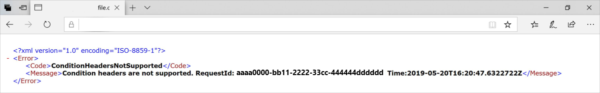
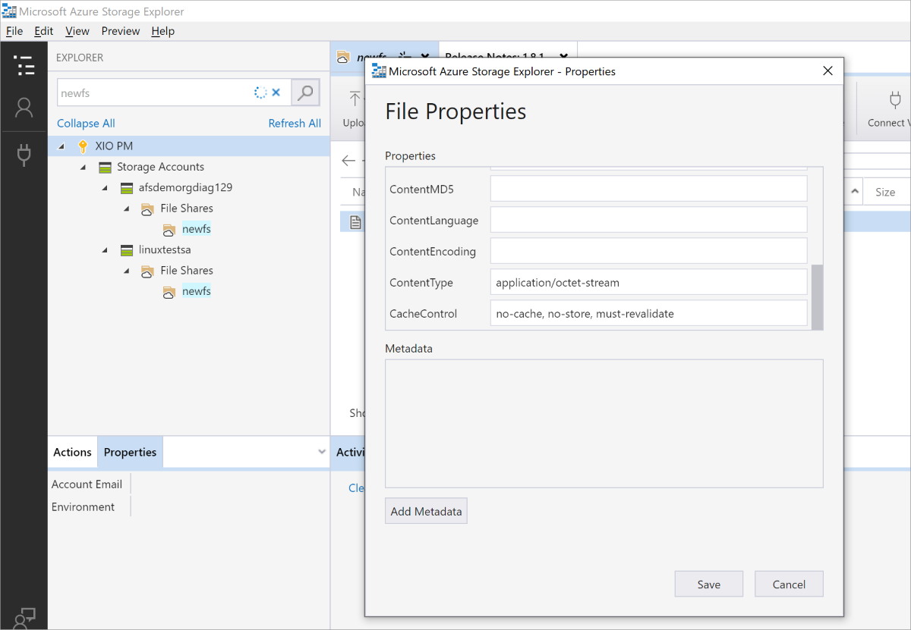

## Error ConditionHeadersNotSupported from a Web Application using Azure Files from Browser

The ConditionHeadersNotSupported error occurs when accessing content hosted in Azure Files through an application that makes use of conditional headers, such as a web browser, access fails. The error states that condition headers aren't supported.

### Cause

Conditional headers aren't currently supported. Applications implementing them will need to request the full file every time the file is accessed.

### Workaround

When a new file is uploaded, the cache-control property by default is “no-cache”. To force the application to request the file every time, the file's cache-control property needs to be updated from “no-cache” to “no-cache, no-store, must-revalidate”. This can be achieved using [Azure Storage Explorer](https://azure.microsoft.com/features/storage-explorer/).

