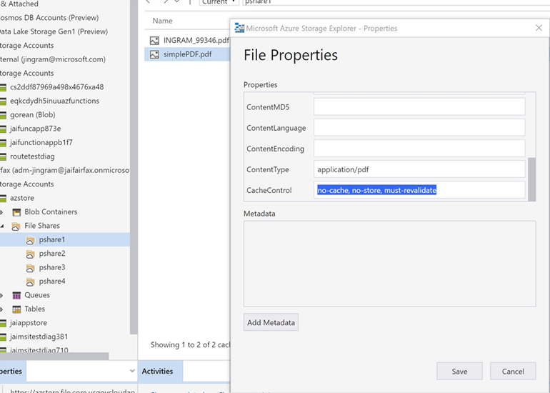

## Error ConditionHeadersNotSupported from a Web Application using Azure Files from Browser

### Cause

Conditional headers are not yet supported.

### Workaround

When a new file is uploaded, the cache-control property by default is “no-cache”.   However; to force the browser to actually request the file every single time with no errors, good to go, it needs to be updated from “no-cache” to “no-cache, no-store, must-revalidate”.

