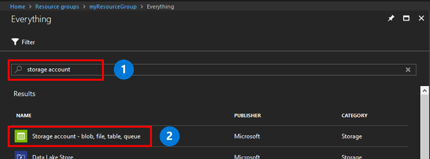

A storage account is a shared pool of storage in which you can deploy an Azure file share or other storage resources, such as blobs or queues. A storage account can contain an unlimited number of shares. A share can store an unlimited number of files, up to the capacity limits of the storage account.

To create a storage account:

1. In the left menu, select **+** to create a resource.
1. In the search box, enter **storage account**, select **Storage account - blob, file, table, queue**, and then select **Create**.
	

1. In **Name**, enter *mystorageacct* followed by a few random numbers, until you see a green check mark that indicates that it's a unique name. A storage account name must be all lowercase and globally unique. Make a note of your storage account name. You will use it later. 
1. In **Deployment model**, leave the default value of **Resource Manager**. To learn more about the differences between Azure Resource Manager and the classic deployment model, see [Understand deployment models and the state of your resources](../articles/azure-resource-manager/management/deployment-models.md).
1. In **Performance**, keep the default value of **Standard**.
    
    > [!NOTE]
    > This quickstart creates a standard file share but, if you wanted to use premium file shares, select **Premium** instead.

1. In **Account kind**, select **StorageV2**. To learn more about the different kinds of storage accounts, see [Understand Azure storage accounts](../articles/storage/common/storage-account-options.md?toc=%2fazure%2fstorage%2ffiles%2ftoc.json).

    > [!NOTE]
    > This quickstart creates a general-purpose v2 account. If you wanted to use premium file shares, select **FileStorage** instead.

1. In **Replication**, select **Locally redundant storage (LRS)**. 
1. In **Secure transfer required**, we recommend that you always select **Enabled**. To learn more about this option, see [Understand encryption in-transit](../articles/storage/common/storage-require-secure-transfer.md?toc=%2fazure%2fstorage%2ffiles%2ftoc.json).
1. In **Subscription**, select the subscription that was used to create the storage account. If you have only one subscription, it should be the default.
1. In **Resource group**, select **Create new**. For the name, enter *myResourceGroup*.
1. In **Location**, select **East US**.
1. In **Virtual networks**, leave the default option as **Disabled**. 
1. To make the storage account easier to find, select **Pin to dashboard**.
1. When you're finished, select **Create** to start the deployment.