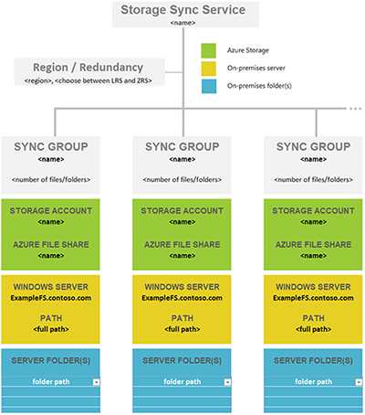

In this step, you're evaluating how many Azure file shares you need. A single Windows Server instance (or cluster) can sync up to 30 Azure file shares.

You may have more folders on your volumes that you currently share out locally as SMB shares to your users and apps. The easiest way is to envision an on-premises share that maps 1:1 to an Azure file share. If you have a small-enough number, below 30 for a single Windows Server instance, then we recommend a 1:1 mapping.

If you have more shares than 30, it's often unnecessary to map an on-premises share 1:1 to an Azure file share. Consider the following options.

#### Share grouping

If your HR department (for instance) has a total of 15 shares, you might consider storing all of the HR data in a single Azure file share. Storing multiple on-premises shares in one Azure file share doesn't prevent you from creating the usual 15 SMB shares on your local Windows Server instance. It only means that you organize the root folders of these 15 shares as subfolders under a common folder. You then sync this common folder to an Azure file share. That way, only a single Azure file share in the cloud is needed for this group of on-premises shares.

#### Volume sync

Azure File Sync supports syncing the root of a volume to an Azure file share. If you sync the root folder, then all subfolders and files will go to the same Azure file share.

Syncing the root of the volume isn't always the best answer. There are benefits in syncing multiple locations. For example, doing so helps keep the number of items lower per sync scope. Setting up Azure File Sync with a lower number of items is not just beneficial for file sync. A lower number of items also benefits scenarios like these:

* Cloud-side restore from an Azure file share snapshot can be taken as a backup.
* Disaster recovery of an on-premises server can speed up significantly.
* Changes made directly in an Azure file share (outside sync) can be detected and synced faster.

#### A structured approach to a deployment map

Before you deploy cloud storage in a later step, it's important to create a map between on-premises folders and Azure file shares. This mapping will then inform how many and which Azure File Sync *sync group* resources you'll provision. A sync group ties the Azure file share and the folder on your server together and establishes a sync connection.

To make the decision about how many Azure file shares you need, review the following limits and best practices. Doing so will help you optimize your map.

* A server with the Azure File Sync agent installed can sync with up to 30 Azure file shares.
* An Azure file share is deployed inside a storage account. That makes the storage account a scale target for performance numbers such as IOPS and throughput. 

  Two standard (not premium) Azure file shares can theoretically saturate the maximum performance that a storage account can deliver. If you plan to only attach Azure File Sync to these file shares, then grouping several Azure file shares into the same storage account won't create a problem. Review the Azure file share performance targets for deeper insight into the relevant metrics to consider. 

  If you plan on lifting an app to Azure that will use the Azure file share natively, then you might need more performance from your Azure file share. If this is a possibility, even in the future, then mapping an Azure file share to its own storage account is best.
* There's a limit of 250 storage accounts per subscription in a single Azure region.

> [!TIP]
> With this information in mind, it often becomes necessary to group multiple top-level folders on your volumes into a common, new root directory. You then sync this new root directory, and all the folders you grouped into it, to a single Azure file share. This technique allows you to stay within the limit of 30 Azure file share syncs per server.
>
> This grouping under a common root has no impact on access to your data. Your ACLs stay as is. You would only need to adjust any share paths (like SMB or NFS shares) you might have on the server folders that you now changed into a common root. Nothing else changes.

Another important aspect of Azure File Sync and a balanced performance and experience is understanding the scale factors for Azure File Sync performance. Obviously, when files are synced over the internet, larger files take more time and bandwidth to sync.

> [!IMPORTANT]
> The most important scale vector for Azure File Sync is the number of items (files and folders) that need to be synchronized.

Azure File Sync supports syncing up to 100,000 items to a single Azure file share. This limit can be exceeded and only shows what the Azure File Sync team tests on a regular basis.

It's a best practice to keep the number of items per sync scope low. That's an important factor to consider in your mapping of folders to Azure file shares.

In your situation, it's possible that a set of folders can logically sync to the same Azure file share (using the new, common root folder approach mentioned earlier). But it might still be better to regroup folders such that they sync to two instead of one Azure file share. You can use this approach to keep the number of files and folders per file share balanced across the server.

#### Create a mapping table

:::row:::
    :::column:::
        
    :::column-end:::
    :::column:::
        Use a combination of the previous concepts to help determine how many Azure file shares you need, and which parts of your existing data will end up in which Azure file share.
        
        Create a table that records your thoughts, so you can refer to it in the next step. Staying organized is important, because it can be easy to lose details of your mapping plan when you're provisioning many Azure resources at once. To help you in creating a complete mapping, you can download a Microsoft Excel file as a template.

[//]: # (HTML appears as the only way to accomplish adding a nested two-column table with working image parsing and text/hyperlink on the same line.)

 
<table>
    <tr>
        <td>
            
        </td>
        <td>
            <a href="https://download.microsoft.com/download/1/8/D/18DC8184-E7E2-45EF-823F-F8A36B9FF240/Azure File Sync - Namespace Mapping.xlsx">Download a namespace-mapping template.</a>
        </td>
    </tr>
</table>
    :::column-end:::
:::row-end:::
