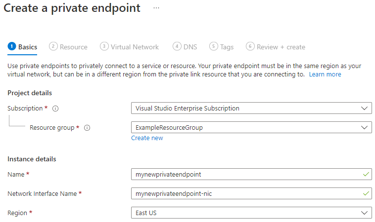
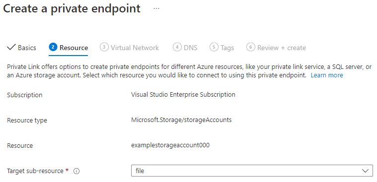
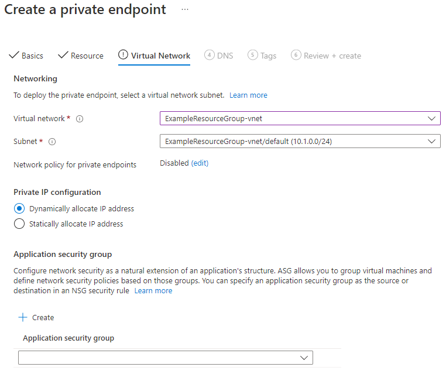
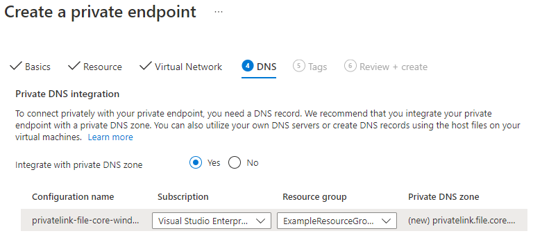
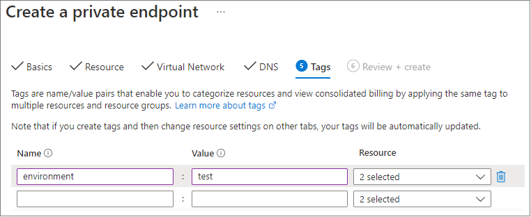

Navigate to the storage account for which you would like to create a private endpoint. In the table of contents for the storage account, select **Networking**, **Private endpoint connections**, and then **+ Private endpoint** to create a new private endpoint.

The resulting wizard has multiple pages to complete.

In the **Basics** blade, select the desired subscription, resource group, name, network interface name, and region for your private endpoint. These can be whatever you want, they don't have to match the storage account in any way, although you must create the private endpoint in the same region as the virtual network you wish to create the private endpoint in. Then select **Next: Resource**.

In the **Resource** blade, select **file** for the target sub-resource. Then select **Next: Virtual Network**.

The **Virtual Network** blade allows you to select the specific virtual network and subnet you would like to add your private endpoint to. Select dynamic or static IP address allocation for the new private endpoint. If you select static, you'll also need to provide a name and a private IP address. You can also optionally specify an application security group. When you're finished, select **Next: DNS**.

The **DNS** blade contains the information for integrating your private endpoint with a private DNS zone. Make sure the subscription and resource group are correct, then select **Next: Tags**.

You can optionally apply tags to categorize your resources, such as applying the name **Environment** and the value **Test** to all testing resources. Enter name/value pairs if desired, and then select **Next: Review + create**.

Click **Review + create** to create the private endpoint.
