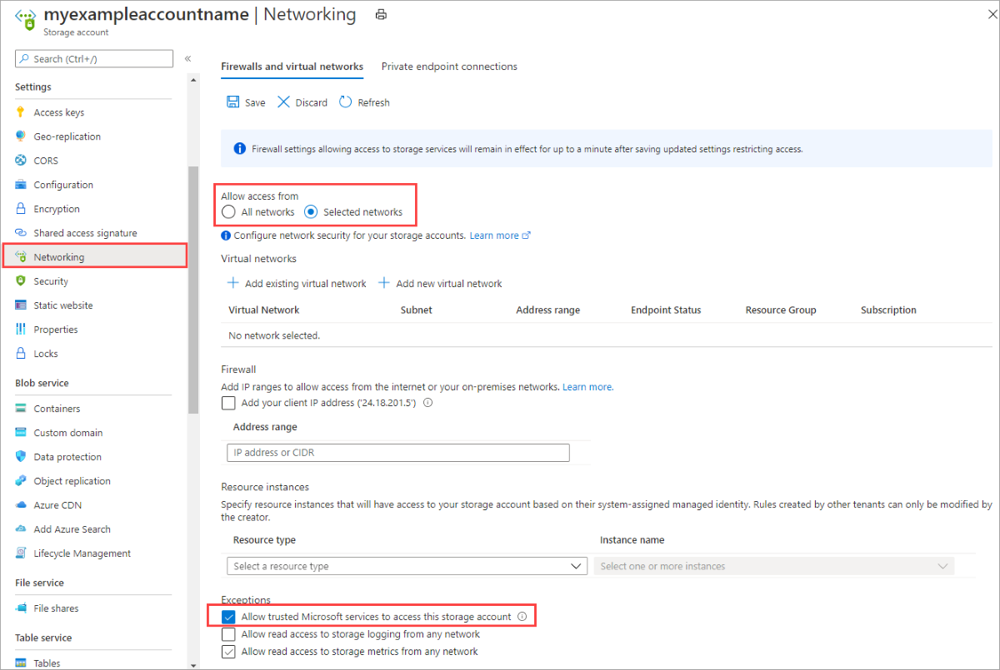

Navigate to the storage account for which you would like to restrict all access to the public endpoint. In the table of contents for the storage account, select **Firewalls and virtual networks**.

At the top of the page, select the **Selected networks** radio button. This will un-hide a number of settings for controlling the restriction of the public endpoint. Check **Allow trusted Microsoft services to access this service account** to allow trusted first party Microsoft services such as Azure File Sync to access the storage account.

