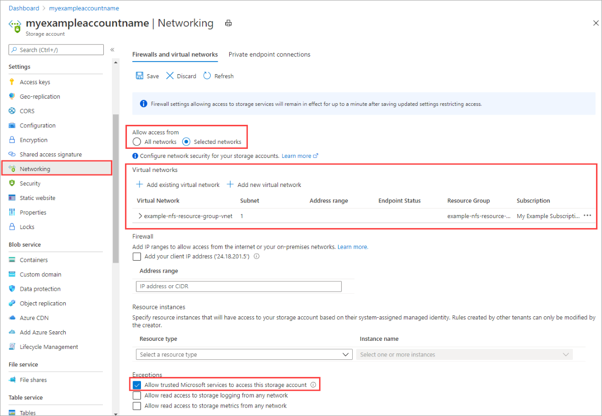

Navigate to the storage account for which you would like to restrict the public endpoint to specific virtual networks. In the table of contents for the storage account, select **Firewalls and virtual networks**. 

At the top of the page, select the **Selected networks** radio button. This will un-hide a number of settings for controlling the restriction of the public endpoint. Click **+Add existing virtual network** to select the specific virtual network that should be allowed to access the storage account via the public endpoint. This will require selecting a virtual network and a subnet for that virtual network. 

Check **Allow trusted Microsoft services to access this service account** to allow trusted first party Microsoft services such as Azure File Sync to access the storage account.

