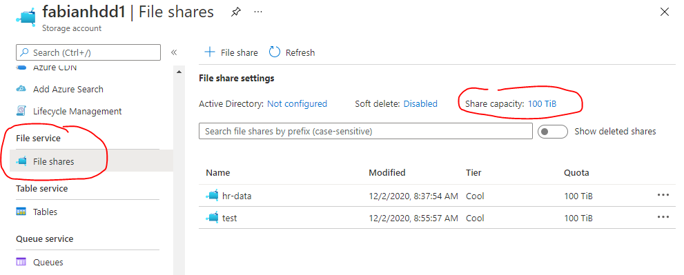

By default, standard file shares can span only up to 5 TiB, although the share limit can be increased to 100 TiB. To do this, *large file share* feature must be enabled at the storage account-level. Premium storage accounts (*FileStorage* storage accounts) don't have the large file share feature flag as all premium file shares are already enabled for provisioning up to the full 100 TiB capacity.

You can only enable large file shares on locally redundant or zone redundant standard storage accounts. Once you have enabled the large file share feature flag, you can't change the redundancy level to geo-redundant or geo-zone-redundant storage.

To enable large file shares on an existing storage account, navigate to **File shares** in the storage account's table of contents.
On this site you will find a list of your file shares and a few settings above that list.
Follow the link for the **Share capacity** setting to opt into 100 TiB file shares.

You can also enable 100 TiB file shares through the [`Set-AzStorageAccount`](/powershell/module/az.storage/set-azstorageaccount) PowerShell cmdlet and the [`az storage account update`](/cli/azure/storage/account#az-storage-account-update) Azure CLI command. For detailed instructions on enabling large files shares, see [enable and create large file shares](../articles/storage/files/storage-files-how-to-create-large-file-share.md).

To learn more about how to create file shares on new storage accounts, see [creating an Azure file share](../articles/storage/files/storage-how-to-create-file-share.md).