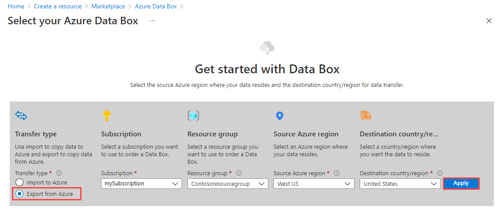
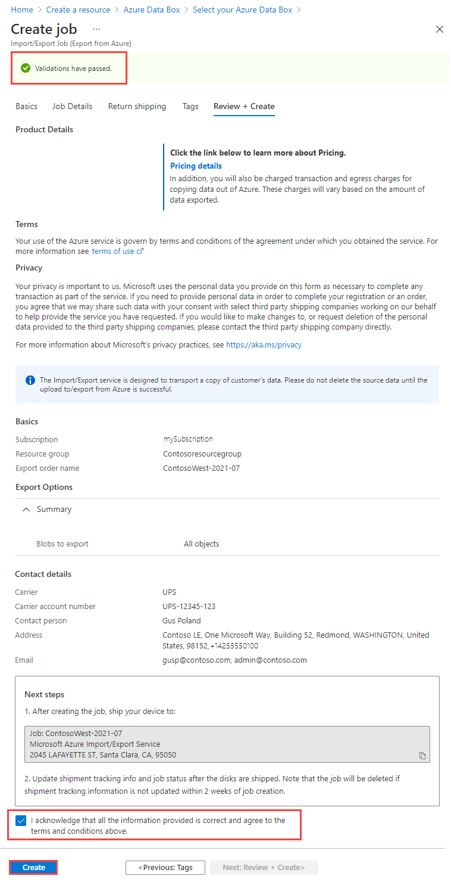
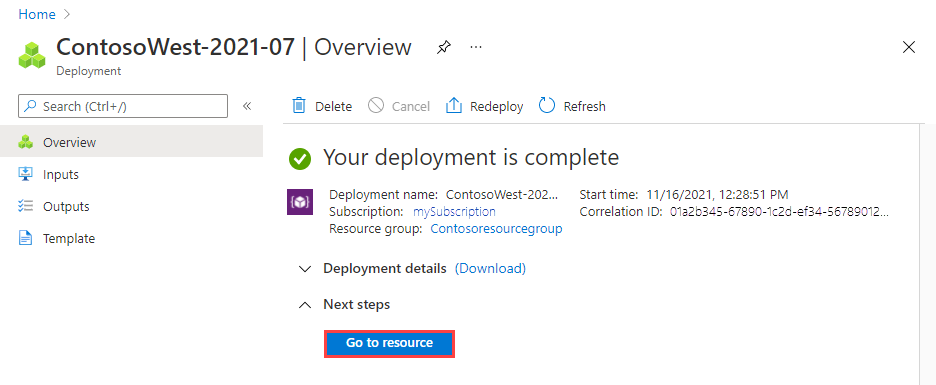

Perform the following steps to order an import job in Azure Import/Export job via the Preview portal.

1. Use your Microsoft Azure credentials to sign in at this URL: [https://portal.azure.com](https://portal.azure.com).
1. Select **+ Create a resource** and search for *Azure Data Box*. Select **Azure Data Box**.

   

1. Select **Create**.  

   

1. To get started with the import order, select the following options:
 
    1. Select the **Export to Azure** transfer type.
    1. Select the subscription to use for the Import/Export job.
    1. Select a resource group.
    1. Select the **Source country/region** for the job.
    1. Select the **Destination Azure region** for the job.
    1. Then select **Apply**.

    

1. Choose the **Select** button for **Import/Export Job**.

    

1. In **Basics**:

    - Enter a descriptive name for the import job. Use the name to track the progress of your jobs.<!--Test name requirements. They appear to be out of date.-->
      * The name may contain only lowercase letters, numbers, and hyphens.
      * The name must start with a letter, and may not contain spaces.

    

    Select **Next: Job details >** to proceed.

5. In **Job details**:

   1. Select the Azure region where your data currently is.
   1. Select the storage account from which you want to export data. Use a storage account close to your location.

      The drop-off location is automatically populated based on the region of the storage account selected.

   1. Specify the blob data to export from your storage account to your blank drive or drives. Choose one of the three following methods.

      - Choose to **Export all** blob data in the storage account.

        

      - Choose **Selected containers and blobs**, and specify containers and blobs to export. You can use more than one of the selection methods. Selecting an **Add** option opens a panel on the right where you can add your selection strings.

        |Option|Description|
        |------|-----------|      
        |**Add containers**|Export all blobs in a container. Select **Add containers**, and enter each container name.|
        |**Add blobs**|Specify individual blobs to export. Select **Add blobs**. Then specify the relative path to the blob, beginning with the container name. Use *$root* to specify the root container. You must provide the blob paths in valid format to avoid errors during processing, as shown in this screenshot. For more information, see [Examples of valid blob paths](../articles/import-export/storage-import-export-determine-drives-for-export.md#examples-of-valid-blob-paths).|
        |**Add prefixes**|Use a prefix to select a set of similarly named containers or similarly named blobs in a container. The prefix may be the prefix of the container name, the complete container name, or a complete container name followed by the prefix of the blob name. |

        :::image type="complex" source="./media/storage-import-export-preview-export-steps/import-export-order-preview-06-b-export-job.png" alt-text="Screenshot showing selected containers and blobs for a new Azure Import/Export export job in the Preview portal.":::
        <Blob selections include a container, a blob, and blob prefixes that work like wildcards. The Add Prefixes pane on the right is used to add prefixes that select blobs based on common text in the blob path or name.>
:::image-end:::

    - Choose **Export from blob list file (XML format)**, and select an XML file that contains a list of paths and prefixes for the blobs to be exported from the storage account. You must construct the XML file and store it in a container for the storage account. The file cannot be empty.

      > [!IMPORTANT]
      > If you use an XML file to select the blobs to export, make sure that the XML contains valid paths and/or prefixes. If the file is invalid or no data matches the paths specified, the order terminates with partial data or no data exported.

      To see how to add an XML file to a container, see [Export order using XML file](../articles/databox/data-box-deploy-export-ordered.md#export-order-using-xml-file).

      

   > [!NOTE]
   > If a blob to be exported is in use during data copy, the Azure Import/Export service takes a snapshot of the blob and copies the snapshot.

   Select **Next: Shipping >** to proceed.

1. In **Return shipping**:storage-import-export-preview-import-steps

   1. Select a shipping carrier from the drop-down list for **Carrier**. The location of the Microsoft datacenter for the selected region determines which carriers are available.
   1. Enter a **Carrier account number**. The account number for an valid carrier account is required.
   1. In the **Return address** area, use **+ Address** to add the address to ship to.

      

      On the **Add address** blade, you can add an address or use an existing one.

      

   1. In the **Notification** area, enter email addresses for the people you want to notify of the job's progress.
   
      > [!TIP]
      > Instead of specifying an email address for a single user, provide a group email to ensure that you receive notifications even if an admin leaves.

   

   Select **Review + Create** to proceed.

1. In **Review + Create**:

   1. Review the **Terms**, and then select "I acknowledge that all the information provided is correct and agree to the terms and conditions." Validation is then performed.
   1. Review the job information provided in the summary. Make a note of the job name and the Azure datacenter shipping address to ship disks back to. This information is used later on the shipping label.
   1. Select **Create**.

   

1. After the job is created, you'll see the following message.

    

     You can select **Go to resource** to open the **Overview** of the job.

     