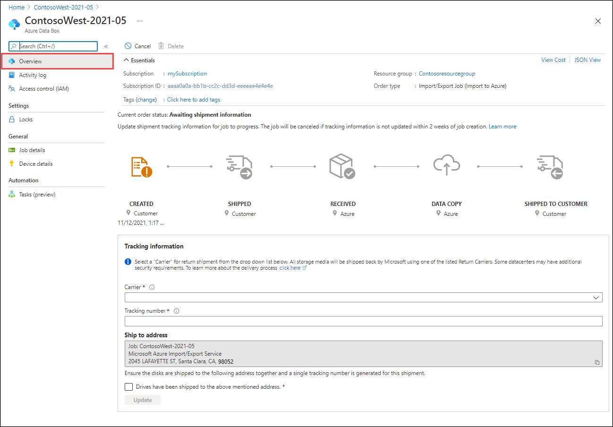

Do the following steps to order an import job in Azure Import/Export job via the portal.

1. Use your Microsoft Azure credentials to sign in at this URL: [https://portal.azure.com](https://portal.azure.com).
1. Select **+ Create a resource**, and search for *Azure Data Box*. Select **Azure Data Box**.

   

1. Select **Create**.  

   

1. To get started with the import order, select the following options:
 
    1. Select the **Import to Azure** transfer type.
    1. Select the subscription to use for the Import/Export job.
    1. Select a resource group.
    1. Select the **Source country/region** for the job.
    1. Select the **Destination Azure region** for the job.
    1. Then select **Apply**.

    

1. Choose the **Select** button for **Import/Export Job**.

    

1. In **Basics**:

    - Enter a descriptive name for the job. Use the name to track the progress of your jobs.
      * The name must have from 3 to 24 characters.
      * The name must include only letters, numbers, and hyphens.
      * The name must start and end with a letter or number.

    

    Select **Next: Job Details >** to proceed.

1. In **Job Details**:

   1. Before you go further, make sure you're using the latest WAImportExport tool. The tool is used to read the journal file(s) that you upload. You can use the download link to update the tool.
   
      

   1. Change the destination Azure region for the job if needed.
   1. Select one or more storage accounts to use for the job. You can create a new storage account if needed.
   1. Under **Drive information**, use the **Copy** button to upload each journal file that you created during the preceding [Step 1: Prepare the drives](#step-1-prepare-the-drives). When you upload a journal file, the Drive ID is displayed.
      - If `waimportexport.exe version1` was used, upload one file for each drive that you prepared. 
      - If the journal file is larger than 2 MB, then you can use the `<Journal file name>_DriveInfo_<Drive serial ID>.xml`, which was created along with the journal file.

        

    

1. In **Return shipping**:

   1. Select a shipping carrier from the drop-down list for **Carrier**. The location of the Microsoft datacenter for the selected region determines which carriers are available.
   1. Enter a **Carrier account number**. The account number for a valid carrier account is required.
   1. In the **Return address** area, select the **+ Add Address** button, and add the address to ship to.

      

      On the **Add Address** blade, you can add an address or use an existing one. When you complete the address fields, select **Add shipping address**.

      

   1. In the **Notification** area, enter email addresses for the people you want to notify of the job's progress.
   
      > [!TIP]
      > Instead of specifying an email address for a single user, provide a group email to ensure that you receive notifications even if an admin leaves.

   

   Select **Review + Create** to proceed.

1. In **Review + Create**:

   1. Review the **Terms** and **Privacy** information, and then select the checkbox by "I acknowledge that all the information provided is correct and agree to the terms and conditions." Validation is then done.
   1. Review the job information. Make a note of the job name and the Azure datacenter shipping address to ship disks back to. This information is used later on the shipping label.
   1. Select **Create**.

   

1. After the job is created, you'll see the following message.

    

     You can select **Go to resource** to open the **Overview** of the job.

     
