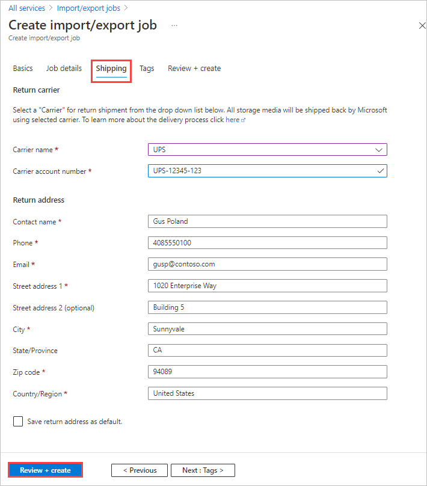

In **Shipping**:

1. Select the carrier that you want to use from the dropdown list for **Carrier name**. Microsoft will use the selected carrier to ship back all storage media.
1. Enter the **Carrier account number** for a valid account that you've created with the carrier. For carrier account requirements, see "Prerequisites," above.
1. Provide a complete and valid contact name, phone, email, street address, city, ZIP code, state/province, and country/region.

   > [!TIP]
   > Instead of specifying an email address for a single user, provide a group email to ensure that you receive notifications even if an admin leaves.

Select **Review + create** to proceed.
