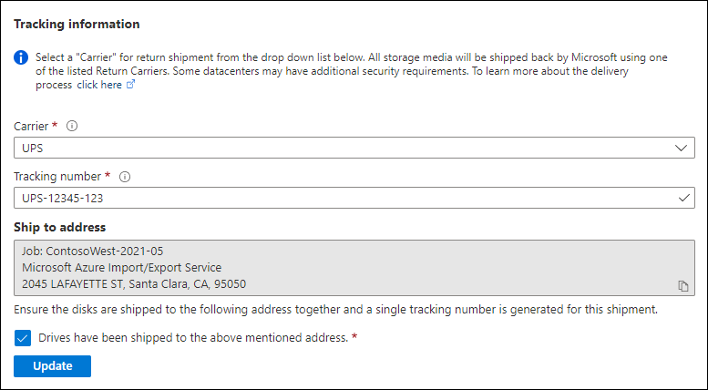
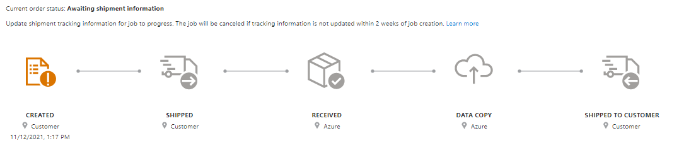
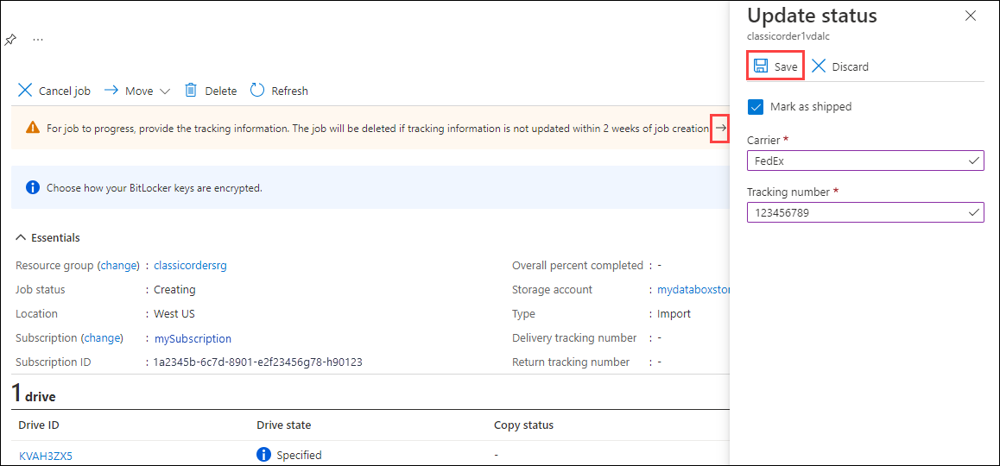

After you ship the disks, return to the job in the Azure portal and fill in the tracking information.

After you provide tracking details, the job status changes to Shipping, and the job can't be canceled. You can only cancel a job while it's in Creating state.

> [!IMPORTANT]
> If the tracking number is not updated within 2 weeks of creating the job, the job expires. 

### [Portal (Preview)](#tab/azure-portal-preview)

To complete the tracking information for a job that you created in the Preview portal, do these steps:
 
1. Open the job in the [Azure portal/](https://portal.azure.com/).
1. On the **Overview** pane, scroll down to **Tracking information** and complete the entries: 
    1. Provide the **Carrier** and **Tracking number**.
    1. Make sure the **Ship to address** is correct.
    1. Select the checkbox by "Drives have been shipped to the above mentioned address."
    1. When you finish, select **Update**.

    

You can track the job progress on the **Overview** pane. For a description of each job state, go to [View your job status](../articles/import-export/storage-import-export-view-drive-status.md).

### [Portal (Classic)](#tab/azure-portal-classic)

To complete the tracking information for a job that you created in the Classic portal, do these steps.
 
1. Open the job in the [Azure portal/](https://portal.azure.com/).
1. At the top of the ****For job to progress, provide the tracking information** to open the **Update status** pane. Then complete the entries: 
    
    1. Select the checkbox by **Mark as shipped**.
    1. Provide the **Carrier** and **Tracking number**.
    1. When you finish, select **Save**.

    

You can track the job progress on the **Overview** pane. For a description of each job state, go to [View your job status](../articles/import-export/storage-import-export-view-drive-status.md).

### [Azure CLI](#tab/azure-cli)

If you created your Azure Import/Export job using Azure CLI, open the job in the Azure portal to update tracking information. Azure CLI and Azure PowerShell create jobs in the classic Azure Import/Export service and hence create an Azure resource of the type "Import/Export job."

### [Azure PowerShell](#tab/azure-powershell)

If you created your Azure Import/Export job using Azure PowerShell, open the job in the Azure portal to update tracking information. 
Azure CLI and Azure PowerShell create jobs in the classic Azure Import/Export service and hence create an Azure resource of the type "Import/Export job."

---

