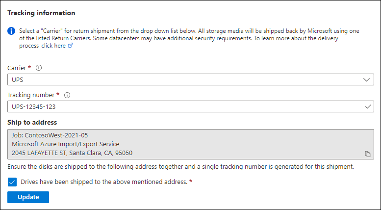

After shipping the disks, return to the job in the Azure portal and fill in the tracking information. 

> [!IMPORTANT] 
> If the tracking number is not updated within 2 weeks of creating the job, the job expires. 

To complete the tracking information, perform the following steps.
 
1. Open the job in the [Azure portal/](https://portal.azure.com/).
1. On the **Overview** pane, scroll down to **Tracking information** and complete the entries: 
    1. Provide the **Carrier** and **Tracking number**.
    1. Make sure the **Ship to address** is correct.
    1. Select the checkbox by **Drives have been shipped to the above mentioned address**.
    1. When you finish, select **Update**.

    

You can track the job progress on the **Overview** pane. For a description of each job state, go to [View your job status](../articles/import-export/storage-import-export-view-drive-status.md).

> [!NOTE]
> You can only cancel a job while it's in Creating state. After you provide tracking details, the job status changes to Shipping, and the job can't be canceled.
