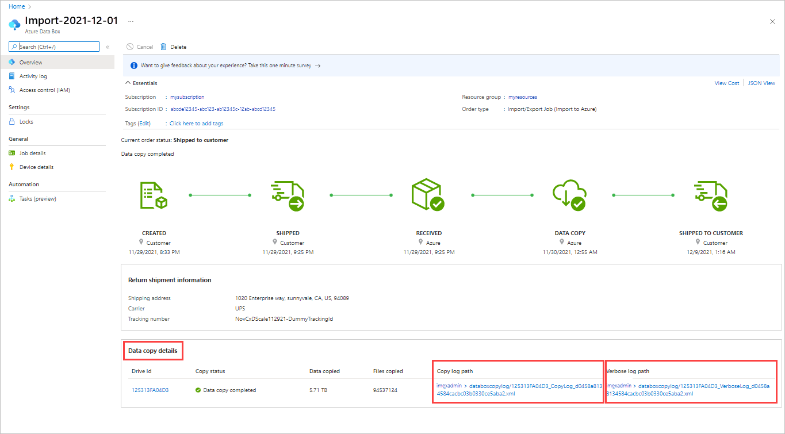

Track the job to completion, then verify that the upload was successful and all data is present. 

Review the **Data copy details** of the completed job to locate the logs for each drive included in the job:

- Use the *verbose log* to verify each successfully transferred file.
- Use the *copy log* to find the source of each failed data copy.

For more information, see [Review copy logs from imports and exports](..\articles\import-export\storage-import-export-tool-reviewing-job-status-v1.md).

After you verify the data transfers, you can delete your on-premises data. Delete your on-premises data only after you verify that the upload was successful.
