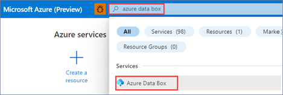
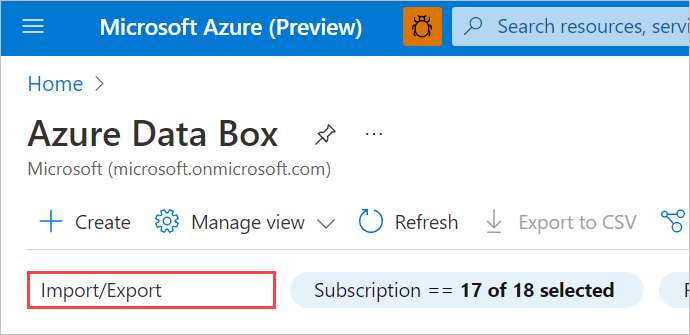
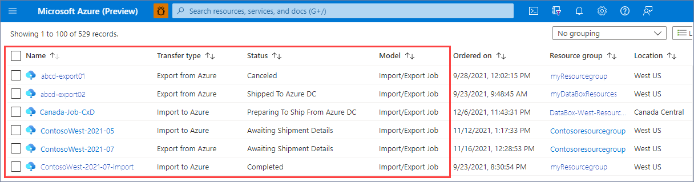
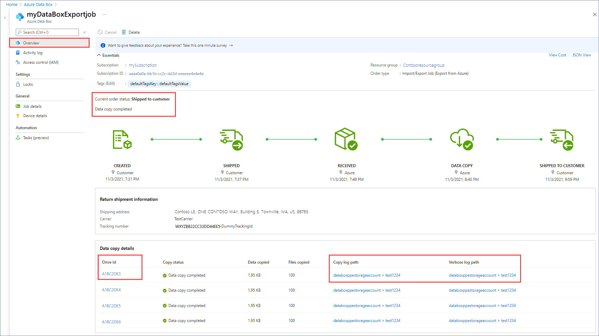

1. Log on to [https://portal.azure.com/](https://portal.azure.com/).

2. Search for **azure data box**.

    

 3. To filter to Azure Import/Export jobs, enter "Import/Export" in the search box.

    

    A list of Import/Export jobs appears on the page. 

    

4. Select a job name to view job details.

   You'll see the **Current order status** and also the **Data copy details** for each drive.

   * If you have access to the storage account, you can select a **Copy log path** or **Verbose log path** to view the log.

   * Select a **Drive ID** to open a panel with full copy information, including the manifest file and hash.

   
