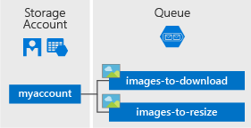

## What is Queue storage?

Azure Queue storage is a service for storing large numbers of messages that can be accessed from anywhere in the world via authenticated calls using HTTP or HTTPS. A single queue message can be up to 64 KB in size, and a queue can contain millions of messages, up to the total capacity limit of a storage account. Queue storage is often used to create a backlog of work to process asynchronously.

## Queue service concepts

The Azure Queue service contains the following components:

* **URL format:** Queues are addressable using the following URL format:
    http://`<storage account>`.queue.core.windows.net/`<queue>`
  
    The following URL addresses a queue in the diagram:  
  
    `http://myaccount.queue.core.windows.net/incoming-orders`

* **Storage Account:** All access to Azure Storage is done through a storage account. For more information about storage accounts, see [Storage account overview](../articles/storage/common/storage-account-overview.md).
* **Queue:** A queue contains a set of messages. All messages must be in a queue. Note that the queue name must be all lowercase. For information on naming queues, see [Naming Queues and Metadata](https://msdn.microsoft.com/library/azure/dd179349.aspx).
* **Message:** A message, in any format, of up to 64 KB. The maximum time that a message can remain in the queue is 7 days. For version 2017-07-29 or later, the maximum time-to-live can be any positive number, or -1 indicating that the message doesn't expire. If this parameter is omitted, the default time-to-live is seven days.

