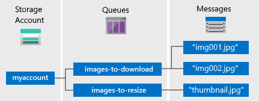

## What is Queue Storage?
Azure Queue storage is a service for storing large numbers of messages that can be accessed from anywhere in the world via authenticated calls using HTTP or HTTPS. A single queue message can be up to 64 KB in size, and a queue can contain millions of messages, up to the total capacity limit of a storage account.

Common uses of Queue storage include:

* Creating a backlog of work to process asynchronously
* Passing messages from an Azure web role to an Azure worker role

## Queue Service Concepts
The Queue service contains the following components:

* **URL format:** Queues are addressable using the following URL format:   
    http://`<storage account>`.queue.core.windows.net/`<queue>` 
  
    The following URL addresses a queue in the diagram:  
  
    `http://myaccount.queue.core.windows.net/images-to-download`

* **Storage Account:** All access to Azure Storage is done through a storage account. See [Azure Storage Scalability and Performance Targets](../articles/storage/common/storage-scalability-targets.md) for details about storage account capacity.
* **Queue:** A queue contains a set of messages. All messages must be in a queue. Note that the queue name must be all lowercase. For information on naming queues, see [Naming Queues and Metadata](https://msdn.microsoft.com/library/azure/dd179349.aspx).
* **Message:** A message, in any format, of up to 64 KB. The maximum time that a message can remain in the queue is 7 days.

