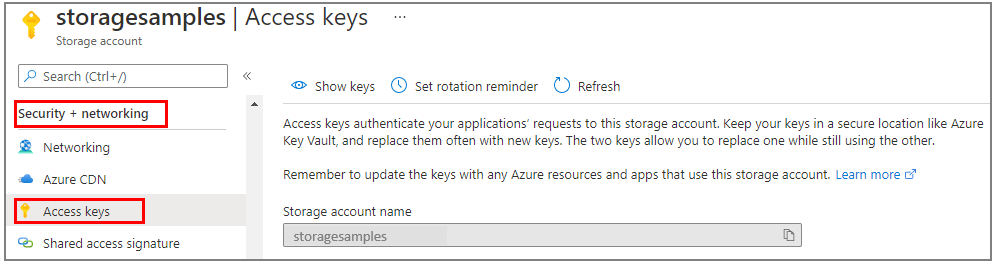

### Copy your credentials from the Azure portal

When the sample application makes a request to Azure Storage, it must be authorized. To authorize a request, add your storage account credentials to the application as a connection string. To view your storage account credentials, follow these steps:

1. Sign in to the [Azure portal](https://portal.azure.com).
2. Locate your storage account.
3. In the storage account menu pane, under **Security + networking**, select **Access keys**. Here, you can view the account access keys and the complete connection string for each key.

    
 
1. In the **Access keys** pane, select **Show keys**.
1. In the **key1** section, locate the **Connection string** value. Select the **Copy to clipboard** icon to copy the connection string. You'll add the connection string value to an environment variable in the next section.

    

### Configure your storage connection string

After you copy the connection string, write it to a new environment variable on the local machine running the application. To set the environment variable, open a console window, and follow the instructions for your operating system. Replace `<yourconnectionstring>` with your actual connection string.

# [Windows](#tab/environment-variable-windows)

```cmd
setx AZURE_STORAGE_CONNECTION_STRING "<yourconnectionstring>"
```

# [Linux and macOS](#tab/environment-variable-linux)

```bash
export AZURE_STORAGE_CONNECTION_STRING="<yourconnectionstring>"
```

---

After you add the environment variable in Windows, you must start a new instance of the command window.

#### Restart programs

After you add the environment variable, restart any running programs that will need to read the environment variable. For example, restart your development environment or editor before you continue.
