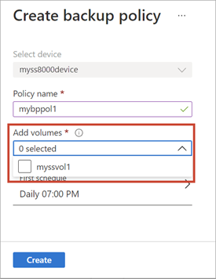
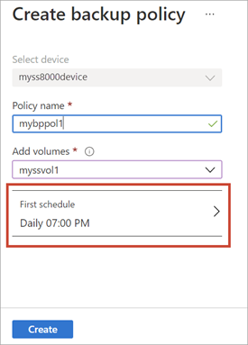
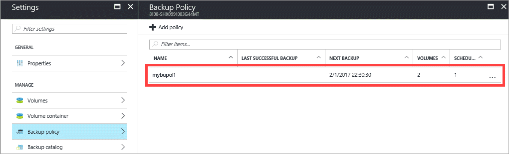

#### To add a StorSimple backup policy

1. Go to your StorSimple device and click **Backup policy**.

2. In the **Backup policy** blade, click **+ Add policy** from the command bar.
   
    

3. In the **Create backup policy** blade, do the following steps:
   
   1. **Select device** is automatically populated based on the device you selected.
   
   2. Specify a backup **Policy name** that has from 3 to 150 characters. Once the policy is created, you cannot rename the policy.
       
   3. To assign volumes to this backup policy, select **Add volumes** and then from the tabular listing of volumes, click the check box(es) to assign one or more volumes to this backup policy.

       <!--Replacement screen source: create-backup-policy-addvolumes.png-->

   4. To define a schedule for this backup policy, click **First schedule** and then modify the following parameters:<!--Do the substeps remain the same? Can they follow without a screenshot?-->

       <!--Replacement screen source: create-backup-policy-first-schedule.png-->

       1. For **Snapshot type**, select **Cloud** or **Local**.

       2. Indicate the frequency of backups (specify a number and then choose **Days** or **Weeks** from the drop-down list.

       3. Enter a retention schedule.

       4. Enter a time and date for the backup policy to begin.

       5. Click **OK** to define the schedule.
       
       > [!NOTE]
       > When you reach 64 backups for a schedule and want to retain those backups, you can [disable the schedule](..\articles\storsimple\storsimple-8000-manage-backup-policies-u2.md#disable-a-schedule) and then add a new schedule with a maximum retention of 64 backups. This workaround will work until you reach the limit of 256 backups per volume. At that point, you'll need to delete older backups before you can take new backups.

   5. Click **Create** to create a backup policy.
   
   6. You are notified when the backup policy is created. The newly added policy is displayed in the tabular view on the **Backup Policy** blade.

       
