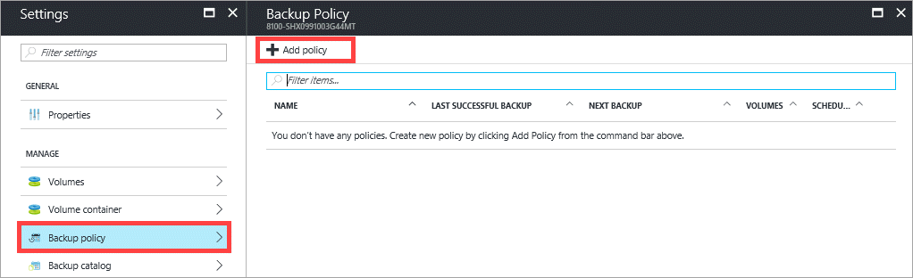
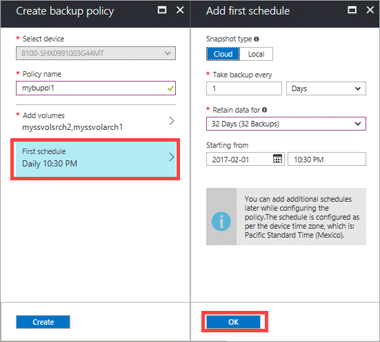
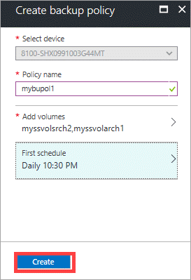

#### To add a StorSimple backup policy

1. Go to your StorSimple device and click **Backup policy**.

2. In the **Backup policy** blade, click **+ Add policy** from the command bar.
   
    

3. In the **Create backup policy** blade, do the following steps:
   
   1. **Select device** is automatically populated based on the device you selected.
   
   2. Specify a backup **Policy name** that contains between 3 and 150 characters. Once the policy is created, you cannot rename the policy.
       
   3. To assign volumes to this backup policy, select **Add volumes** and then from the tabular listing of volumes, click the check box(es) to assign one or more volumes to this backup policy.

       

   4. To define a schedule for this backup policy, click **First schedule** and then modify the following parameters:

       

       1. For **Snapshot type**, select **Cloud** or **Local**.

       2. Indicate the frequency of backups (specify a number and then choose **Days** or **Weeks** from the drop-down list.

       3. Enter a retention schedule.

       4. Enter a time and date for the backup policy to begin.

       5. Click **OK** to define the schedule.

   5. Click **Create** to create a backup policy.

       
   
   6. You are notified when the backup policy is created. The newly added policy is displayed in the tabular view on the **Backup Policy** blade.

       

