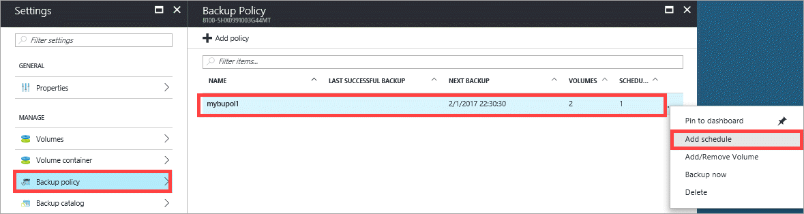
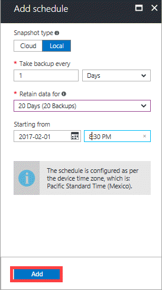
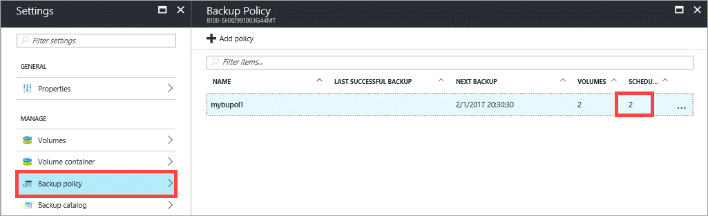

#### To add or modify a StorSimple backup schedule

1. Go to your StorSimple device and click **Backup policy**.

2. In the tabular listing of the policies, select and click the policy that you want to modify. Right-click to invoke the context menu and then select **Add schedule**.

    

3. In the **Add schedule** blade, modify the snapshot type, backup frequency, retention, and start date and time. Click **Add**.

    

4. You are notified when the backup policy creation is complete. The backup policy list is also updated.

    

