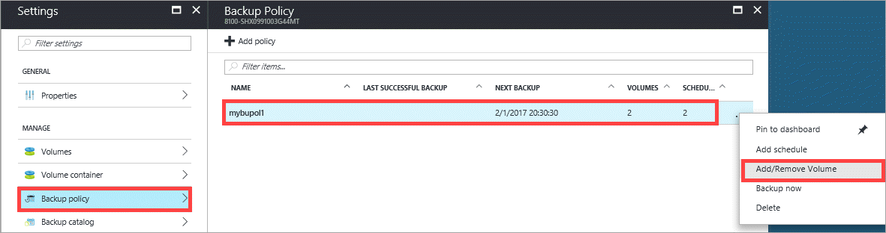
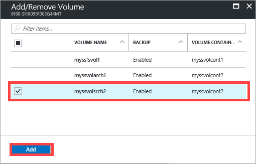
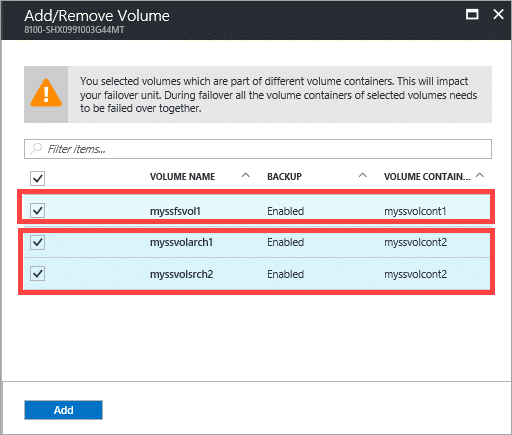
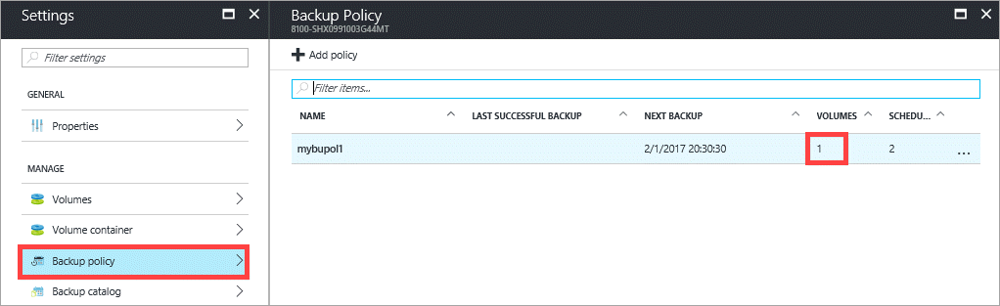

#### To add or remove a volume

1. Go to your StorSimple device and click **Backup policy**.

2. In the tabular listing of the policies, select and click the policy that you want to modify. Right-click to invoke the context menu and then select **Add/remove volume**.

    

3. In the **Add/remove volume** blade, select or clear the check box(es) to add or remove the volume. Multiple volumes are selected/cleared by checking or clearing the corresponding checkboxes.

    

    If you assign volumes from different volume containers to a backup policy, then you will need to remember to fail over those volume containers together. You will see a warning to that effect.

    

4. You are notified when the backup policy is modified. The backup policy list is also updated.

    

