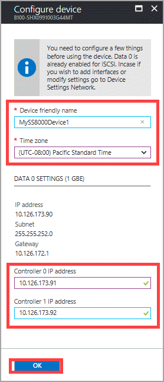
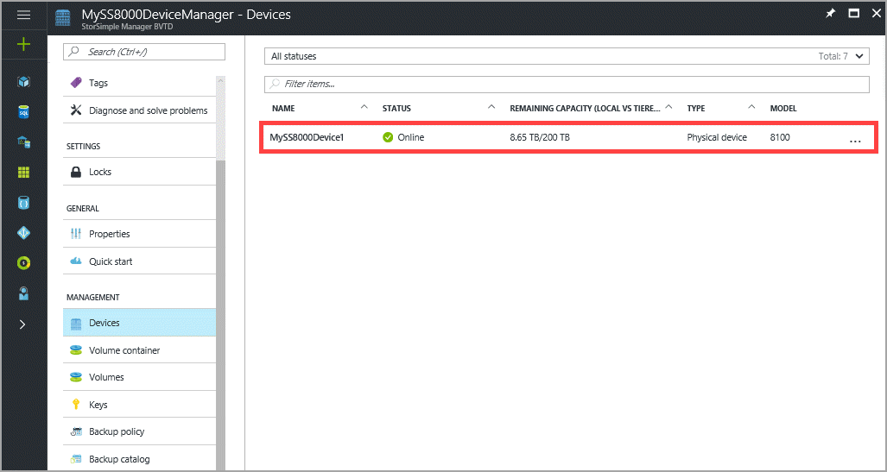

#### To complete the minimum StorSimple device setup

   > [!NOTE]
   > You cannot change the device name once the minimum device setup is completed.
   
1. From the tabular listing of devices in the **Devices** blade, select and click your device. The device is in a **Ready to set up** state. The **Configure device** blade opens up.

     

2. In the **Configure device** blade:
   
   1. Supply a **friendly name** for your device. The default device name reflects information such as the device model and serial number. You can assign a friendly name of up to 64 characters to manage your device.
   2. Set the **time zone** based on the geographic location in which the device is being deployed. Your device uses this time zone for all scheduled operations.
   3. Under the **DATA 0 settings**:

       1. Your DATA 0 network interface shows as enabled with the network settings (IP, subnet, gateway) configured via the setup wizard. DATA 0 is also automatically enabled for cloud as well as iSCSI.

       2. Provide the fixed IP addresses for Controller 0 and Controller 1. **The controller fixed IP addresses need to be free IPs within the subnet accessible by the device IP address.** If the DATA 0 interface was configured for IPv4, the fixed IP addresses need to be provided in the IPv4 format. If you provided a prefix for IPv6 configuration, the fixed IP addresses are populated automatically in these fields.

            

            The fixed IP addresses for the controller are used for servicing the updates to the device and for garbage collection. Therefore, the fixed IPs must be routable and able to connect to the Internet. You can check that your fixed controller IPs are routable by using the [Test-HcsmConnection][Test] cmdlet. The following example shows fixed controller IPs are routed to the Internet and can access the Microsoft Update servers.

            

1. Click **OK**. The device configuration starts. When the device configuration is complete, you are notified. The device status changes to **Online** in the **Devices** blade.

    

<!--Link reference-->
[Test]: https://technet.microsoft.com/library/dn715782(v=wps.630).aspx
