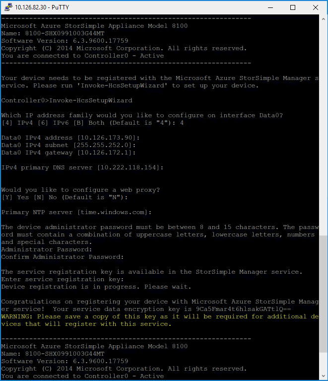
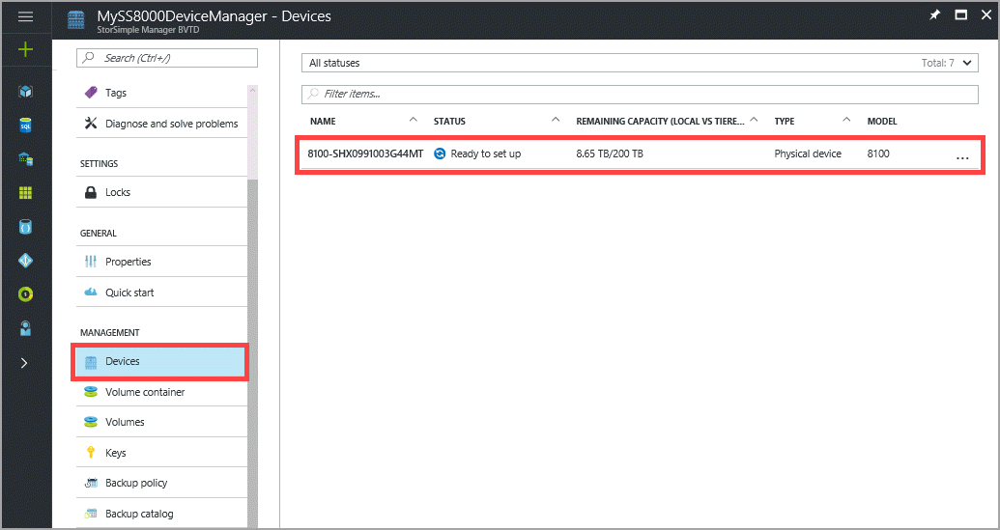

#### To configure and register the device

1. Access the Windows PowerShell interface on your StorSimple device serial console. See [Use PuTTY to connect to the device serial console](#use-putty-to-connect-to-the-device-serial-console) for instructions. **Be sure to follow the procedure exactly or you will not be able to access the console.**

2. In the session that opens up, press **Enter** one time to get a command prompt.

3. You will be prompted to choose the language that you would like to set for your device. Specify the language, and then press **Enter**.

4. In the serial console menu that is presented, choose option 1, **Log in with full access**.
     Complete steps 5-12 to configure the minimum required network settings for your device. **These configuration steps need to be performed on the active controller of the device.** The serial console menu indicates the controller state in the banner message. If you are not connected to the active controller, disconnect and then connect to the active controller.

5. At the command prompt, type your password. The default device password is **Password1**.

6. Type the following command: `Invoke-HcsSetupWizard`.

7. A setup wizard will appear to help you configure the network settings for the device. Supply the following information:
   
   * IP address for the DATA 0 network interface
   * Subnet mask
   * Gateway
   * IP address for Primary DNS server

   A sample output is presented below.

    ```
        ---------------------------------------------------------------
        Microsoft Azure StorSimple Appliance Model 8100
        Name: 8100-SHX0991003G44MT
        Software Version: 6.3.9600.17759
        Copyright (C) 2014 Microsoft Corporation. All rights reserved.
        You are connected to Controller0 - Active
        ---------------------------------------------------------------

        Your device needs to be registered with the Microsoft Azure StorSimple Manager service. Please run 'Invoke-HcsSetupWizard' to set up your device.

        Controller0>Invoke-HcsSetupWizard

        Which IP address family would you like to configure on interface Data0?
        [4] IPv4 [6] IPv6 [B] Both (Default is "4"): 4

        Data0 IPv4 address:10.111.111.00
        Data0 IPv4 subnet: 255.255.252.0
        Data0 IPv4 gateway: 10.111.111.11

        IPv4 primary DNS server [10.222.118.154]:10.222.222.111
    ```

    <br>
    In the preceding sample output, you can see that the system is validating network settings after each step in the process.

     > [!NOTE]
     > You may have to wait for a few minutes for the subnet mask and the DNS settings to be applied. If you get a "Check the network connectivity to Data 0" error message, check the physical network connection on the DATA 0 network interface of your active controller.

8. (Optional) configure your web proxy server. Although web proxy configuration is optional, **be aware that if you use a web proxy, you can only configure it here**. For more information, go to [Configure web proxy for your device](../articles/storsimple/storsimple-8000-configure-web-proxy.md).
9. Configure a Primary NTP server for your device. NTP servers are required, as your device must synchronize time so that it can authenticate with your cloud service providers. Ensure that your network allows NTP traffic to pass from your datacenter to the Internet. If this is not possible, specify an internal NTP server.

    A sample output is shown below.

    ```
        Would you like to configure a web proxy?
        [Y] Yes [N] No (Default is "N"):N

        Primary NTP server [time.windows.com]:time.windows.com

    ```

10. For security reasons, the device administrator password expires after the first session, and you will need to change it now. When prompted, provide a device administrator password. A valid device administrator password must be between 8 and 15 characters. The password must contain three of the following: lowercase, uppercase, numeric, and special characters.

    ```
        The device administrator password must be between 8 and 15 characters. The password must contain a combination of uppercase letters, lowercase letters, numbers and special characters.
        Administrator Password:********
        Confirm Administrator Password:********
    ```
11. The final step in the setup wizard registers your device with the StorSimple Device Manager service. For this, you will need the service registration key that you obtained in step 2. After you supply the registration key, you may need to wait for 2-3 minutes before the device is registered.
    
    > [!NOTE]
    > You can press Ctrl + C at any time to exit the setup wizard. If you have entered all the network settings (IP address for Data 0, Subnet mask, and Gateway), your entries will be retained.
    
    A sample output is shown below.

    ```
        The service registration key is available in the StorSimple Manager service.
        Enter service registration key:**************************************
        Device registration is in progress. Please wait.

    ```

12. After the device is registered, a Service Data Encryption key will appear. Copy this key and save it in a safe location. **This key will be required with the service registration key to register additional devices with the StorSimple Device Manager service.** Refer to [StorSimple security](../articles/storsimple/storsimple-8000-security.md) for more information about this key.
    
    
    
    > [!NOTE]
    > To copy the text from the serial console window, simply select the text. You should then be able to paste it in the clipboard or any text editor. DO NOT use Ctrl + C to copy the service data encryption key. Using Ctrl + C will cause you to exit the setup wizard. As a result, the device administrator password will not be changed and the device will revert to the default password.
    
13. Exit the serial console.
14. Return to the Azure portal, and complete the following steps:
    
    1. Go to your StorSimple Device Manager service.
    2. Click **Devices**.
    3. In the tabular listing of devices, verify that the device has successfully connected to the service by looking up the status. The device status should be **Ready to set up**.
       
        
       
        You may need to wait for a couple of minutes for the device status to change to **Ready to set up**.
       
        If the device does not show up in this list, then you need to make sure that your firewall network was configured as described in [networking requirements for your StorSimple device](../articles/storsimple/storsimple-8000-system-requirements.md). Verify that port 9354 is open for outbound communication as this is used by the service bus for StorSimple Device Manager service-to-device communication.