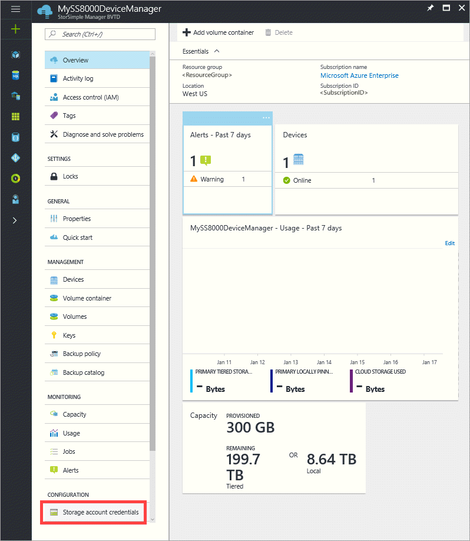
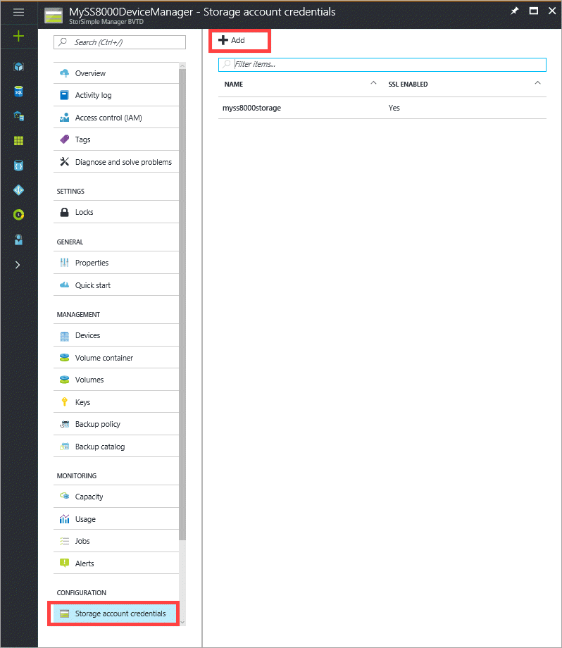
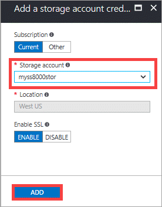
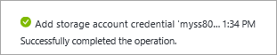

#### To add a storage account credential in the same Azure subscription as the StorSimple Device Manager service

1. Go to your StorSimple Device Manager service. In the **Configuration** section, click **Storage account credentials**.

    

2. On the **Storage account credentials** blade, click **+ Add**.

    

3. In the **Add a storage account credential** blade, do the following steps:

    1. As you are adding a storage account credential in the same Azure subscription as your service, ensure that **Current** is selected.

    2. From the **storage account** dropdown list, select an existing storage account.

    3. Based on the storage account selected, the **location** will be displayed (grayed out and cannot be changed here).

    4. Select **Enable SSL Mode** to create a secure channel for network communication between your device and the cloud. Disable **Enable SSL** only if you are operating within a private cloud.

        

    5. Click **Add** to start the job creation for the storage account credential. You will be notified after the storage account credential is successfully created.

        

The newly created storage account credential will be displayed under the list of **Storage account credentials**.

