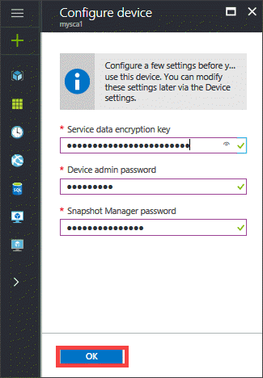
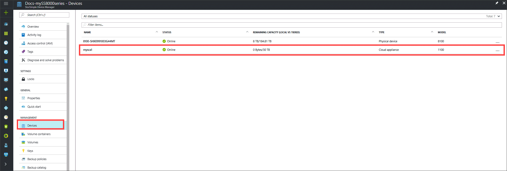

#### To configure and register the cloud appliance

1. Select and click the StorSimple Cloud Appliance you created in the **Devices** blade.

    
2. In the **Configure device** blade, do the following steps:
    
    1. Enter the **Service Data Encryption Key** in the space provided. This key is generated when you registered the first physical device with your StorSimple Device Manager service.

    2. Enter the **Device admin password** and **Snapshot Manager** password of the specified length and settings.

    3. Click **OK** to finish the initial configuration and registration of the cloud appliance.
    
        

After the configuration and registration is complete, the device will come online. (It may take several minutes for the device to come online.)

