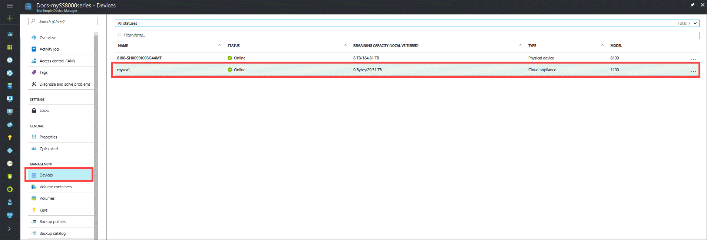
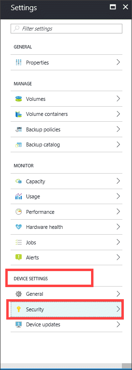
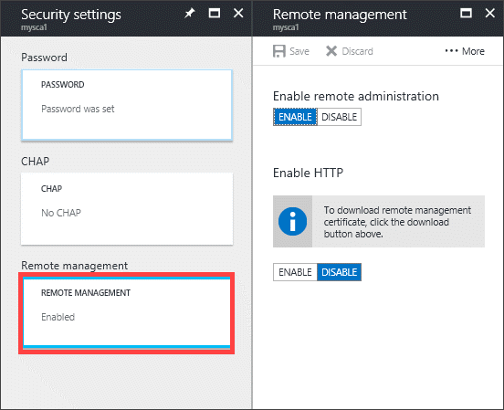
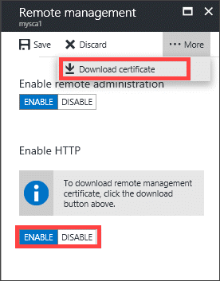

#### To configure remote management on cloud appliance

1. In your StorSimple Device Manager service, click **Devices**. Select and click your cloud appliance from the list of devices connected to the service.
    

2. Go to **Settings > Security** to open the **Security settings** blade.

     

3. Go to the **Remote Management** section. Click **Remote management** box.
     

4. In the **Remote management** blade:

    1. Ensure **Enable remote administration** is enabled.
    2. The default is to connect over HTTPS. You can choose to connect using HTTP. Connecting over HTTP is acceptable only on trusted networks. Ensure that HTTP is enabled.
    3. From the command bar at the top of blade, click **... More** and then click **Download certificate** to download a remote management certificate. You can specify a location in which to save this file. This certificate should be installed on the client or host machine that you use to connect to the cloud appliance.

        
5. Click **Save** and when prompted, confirm the changes.