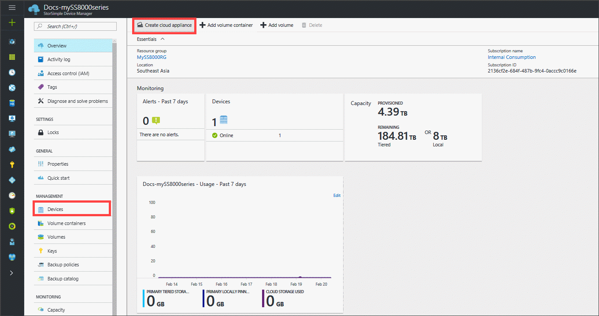
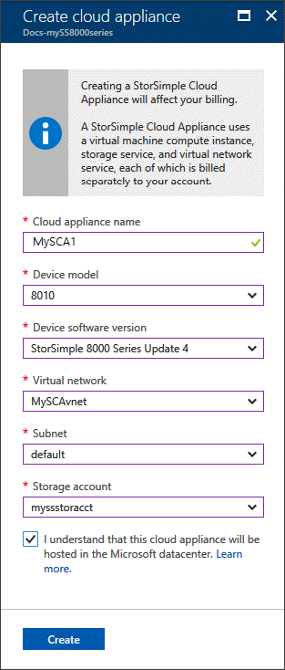
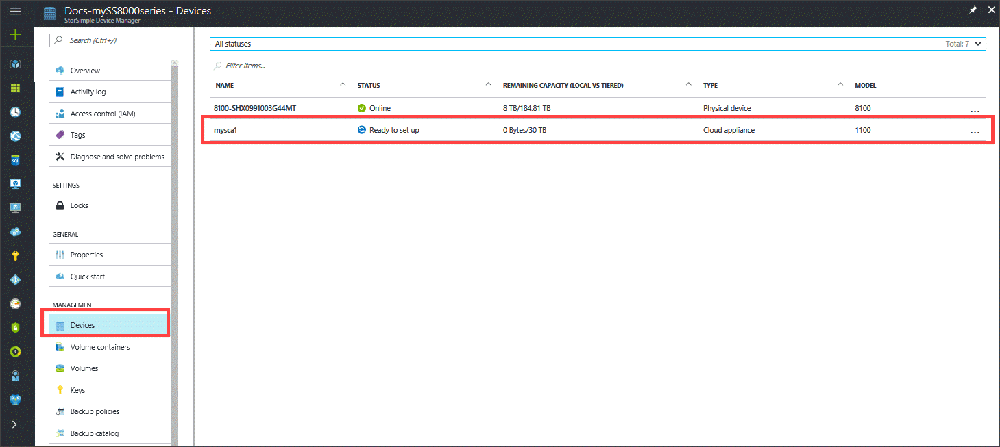

#### To create a cloud appliance

1. In the Azure portal, go to the **StorSimple Device Manager** service.
2. Go to the **Devices** blade. From the command bar in the service summary blade, click **Create cloud appliance**.
    
3. In the **Create cloud appliance** blade, specify the following details.
   
    
   
   1. **Name** – A unique name for your cloud appliance.
   2. **Model** - Choose the model of the cloud appliance. An 8010 device offers 30 TB of Standard Storage whereas 8020 has 64 TB of Premium Storage. Specify 8010 to deploy item level retrieval scenarios from backups. Select 8020 to deploy high performance, low latency workloads, or use as a secondary device for disaster recovery.
   3. **Version** - Choose the version of the cloud appliance. The version corresponds to the version of the virtual disk image that is used to create the cloud appliance. Given the version of the cloud appliance determines which physical device you fail over or clone from, it is important that you create an appropriate version of the cloud appliance.
   4. **Virtual network** – Specify a virtual network that you want to use with this cloud appliance. If using Premium Storage, you must select a virtual network that is supported with the Premium Storage account. The unsupported virtual networks are grayed out in the dropdown list. You are warned if you select an unsupported virtual network.
   5. **Subnet** - Based on the virtual network selected, the dropdown list displays the associated subnets. Assign a subnet to your cloud appliance.
   6. **Storage account** – Select a storage account to hold the image of the cloud appliance during provisioning. This storage account should be in the same region as the cloud appliance and virtual network. It should not be used for data storage by either the physical or the cloud appliance. By default, a new storage account is created for this purpose. However, if you know that you already have a storage account that is suitable for this use, you can select it from the list. If creating a premium cloud appliance, the dropdown list only displays Premium Storage accounts.
      
      > [!NOTE]
      > The cloud appliance can only work with the Azure storage accounts.
    
   7. Select the checkbox to indicate that you understand that the data stored on the cloud appliance is hosted in a Microsoft datacenter.
       * When you use only a physical device, your encryption key is kept with your device; therefore, Microsoft cannot decrypt it.

       * When you use a cloud appliance, both the encryption key and the decryption key are stored in Microsoft Azure. For more information, see [security considerations for using a cloud appliance](../articles/storsimple/storsimple-security.md).
   8. Click **Create** to provision the cloud appliance. The device may take around 30 minutes to be provisioned. You are notified when the cloud appliance is successfully created. Go to Devices blade, and the list of devices refreshes to display the cloud appliance. The status of the appliance is **Ready to set up**.
      
      

