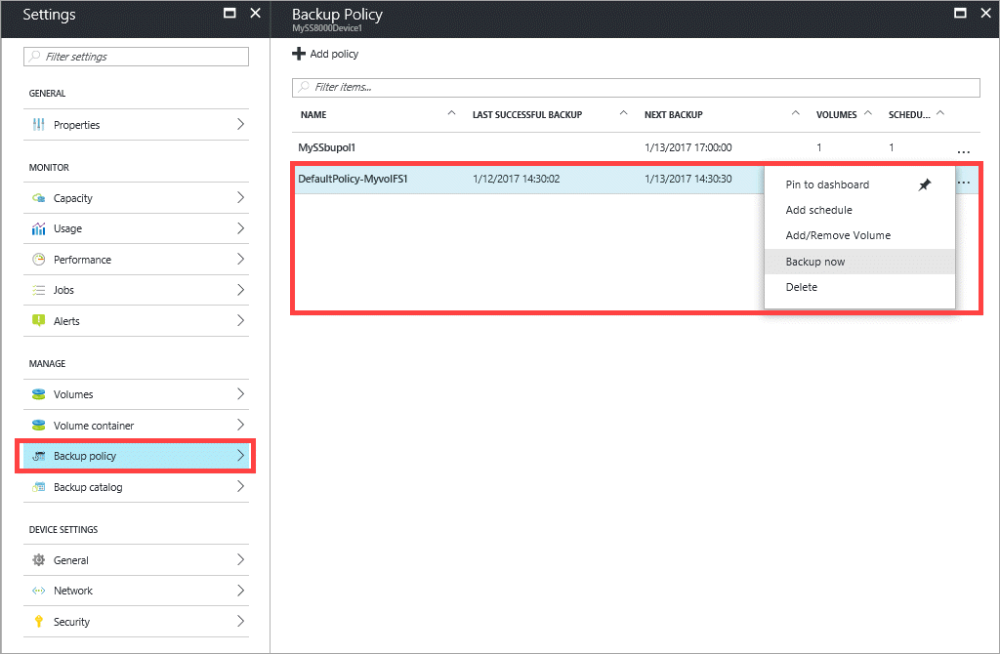
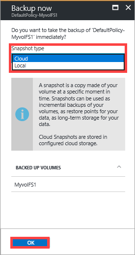

#### To create a manual backup

1. Go to your StorSimple Device Manager service and then click **Devices**. From the tabular listing of devices, select your device. Go to **Settings > Manage > Backup policies**.

2. The **Backup policies** blade lists all the backup policies in a tabular format, including the policy for the volume that you want to back up. Select the policy associated with the volume you want to back up and right-click to invoke the context menu. From the dropdown list, select **Back up now**.

    

3. In the **Back up now** blade, do the following steps:

    1. Choose the appropriate **Snapshot type** from the dropdown list: **Local** snapshot or **Cloud** snapshot. Select local snapshot for fast backups or restores, and cloud snapshot for data resiliency.

        

    2. Click **OK** to start a job to create a snapshot. You will see a notification at the top of the page after the job is successfully created.

        

    3. To monitor the job, click the notification. This takes you to the **Jobs** blade where you can view the job progress.

5. After the backup job is finished, go to the **Backup catalog** tab.

6. Set the filter selections to the appropriate device, backup policy, and time range. The backup should appear in the list of backup sets that is displayed in the catalog.

