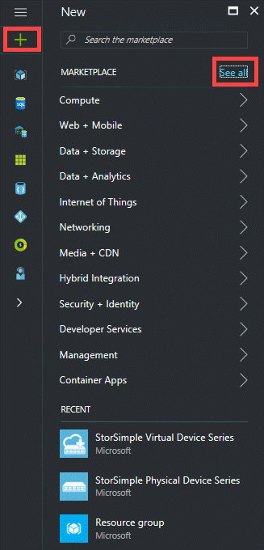
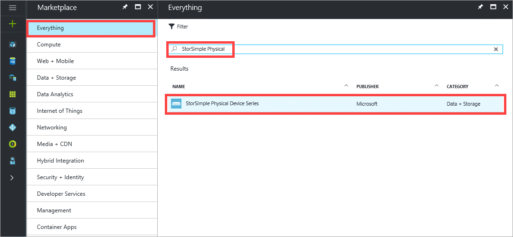
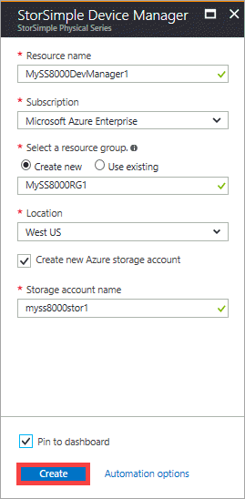
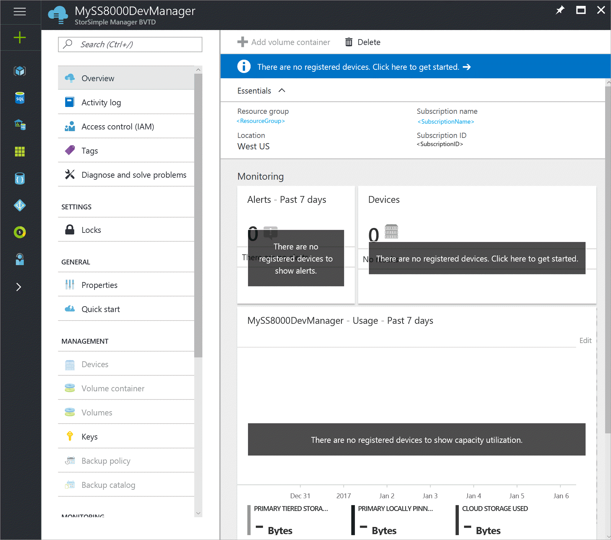

#### To create a new service

1. Use your Microsoft account credentials to sign in to the [Azure portal](https://portal.azure.com/).

2. In the Azure portal, click **Create a resource** and then in the marketplace, click **See all**.

    

    Search for _StorSimple Physical_. Select and click **StorSimple Physical Device Series** and then click **Create**. Alternatively, in the Azure portal click **+** and then under **Storage**, click **StorSimple Physical Device Series**.

    

3. In the **StorSimple Device Manager** blade, do the following steps:

   1. Supply a unique **Resource name** for your service. This name is a friendly name that can be used to identify the service. The name can have between 2 and 50 characters that can be letters, numbers, and hyphens. The name must start and end with a letter or a number.

   2. Choose a **Subscription** from the drop-down list. The subscription is linked to your billing account. This field is not present if you have only one subscription.

   3. For **Resource group**, **Use existing** or **Create new** group. For more information, see [Azure resource groups](https://azure.microsoft.com/documentation/articles/virtual-machines-windows-infrastructure-resource-groups-guidelines/).

   4. Supply a **Location** for your service. In general, choose a location closest to the geographical region where you want to deploy your device. You may also want to factor in the following considerations:

      * If you have existing workloads in Azure that you also intend to deploy with your StorSimple device, you should use that datacenter.
      * Your StorSimple Device Manager service and Azure storage can be in two separate locations. In such a case, you are required to create the StorSimple Device Manager and Azure storage account separately. To create an Azure storage account, go to the Azure Storage service in the Azure portal and follow the steps in [Create an Azure Storage account](../articles/storage/common/storage-account-create.md). After you create this account, add it to the StorSimple Device Manager service by following the steps in [Configure a new storage account for the service](../articles/storsimple/storsimple-8000-deployment-walkthrough-u2.md#configure-a-new-storage-account-for-the-service).

   5. Select **Create a new storage account** to automatically create a storage account with the service. Specify a name for this storage account. If you need your data in a different location, uncheck this box.

   6. Check **Pin to dashboard** if you want a quick link to this service on your dashboard.

   7. Click **Create** to create the StorSimple Device Manager.

       

The service creation takes a few minutes. After the service is successfully created, you will see a notification and the new service blade opens up.

