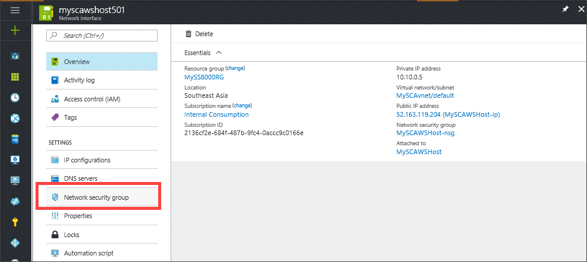
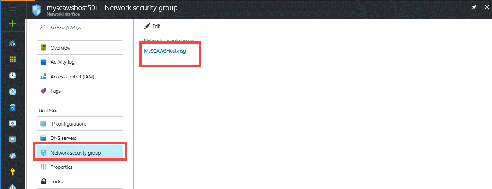
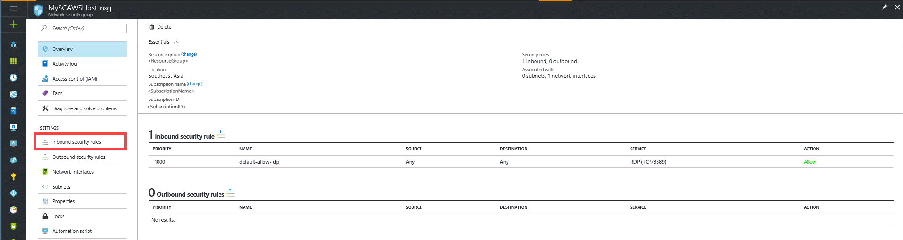
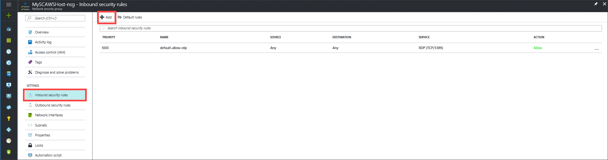
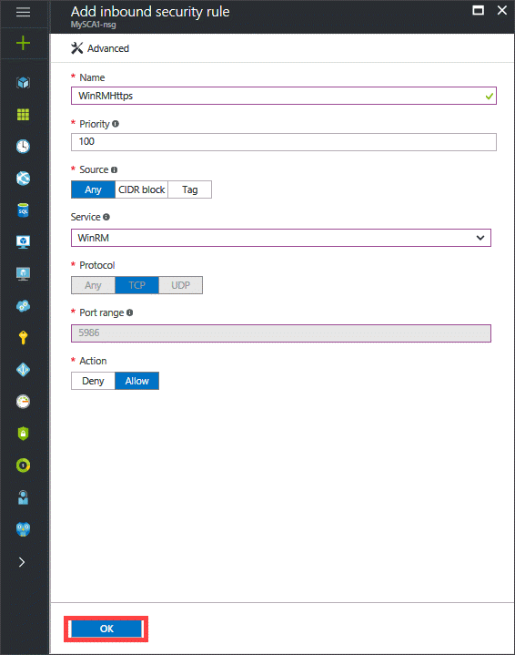
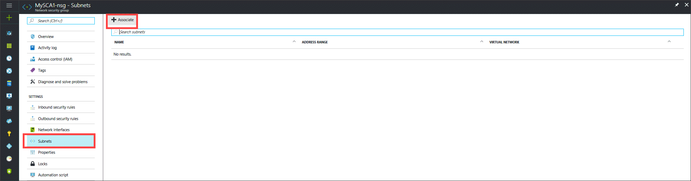
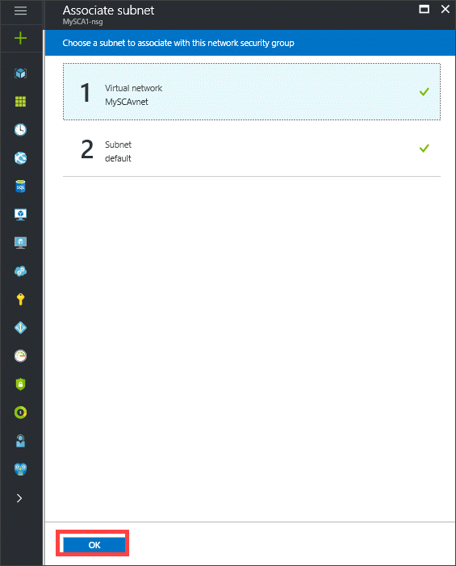

#### To create public endpoints on the cloud appliance

1. Sign in to the Azure portal.
2. Go to **Virtual Machines**, and then select and click the virtual machine that is being used as your cloud appliance.
    
3. You need to create a network security group (NSG) rule to control the flow of traffic in and out of your virtual machine. Perform the following steps to create an NSG rule.
    1. Select **Network security group**.
        

    2. Click the default network security group that is presented.
        

    3. Select **Inbound security rules**.
        

    4. Click **+ Add** to create an inbound security rule.
        

        In the Add inbound security rule blade:

        1. For the **Name**, type the following name for the endpoint: WinRMHttps.
        
        2. For the **Priority**, select a number lesser than 1000 (which is the priority for the default rule). Higher the value, lower the priority.

        3. Set the **Source** to **Any**.

        4. For the **Service**, select **WinRM**. The **Protocol** is automatically set to **TCP** and the **Port range** is set to **5986**.

        5. Click **OK** to create the rule.

            

4. Your final step is to associate your network security group with a subnet or a specific network interface. Perform the following steps to associate your network security group with a subnet.
    1. Go to **Subnets**.
    2. Click **+ Associate**.
        

    3. Select your virtual network, and then select the appropriate subnet.
    4. Click **OK** to create the rule.

        

After the rule is created, you can view its details to determine the Public Virtual IP (VIP) address. Record this address.

